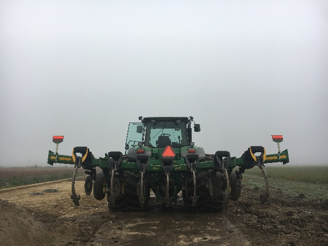
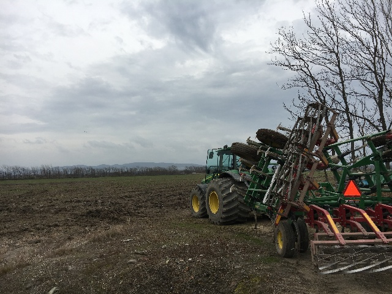
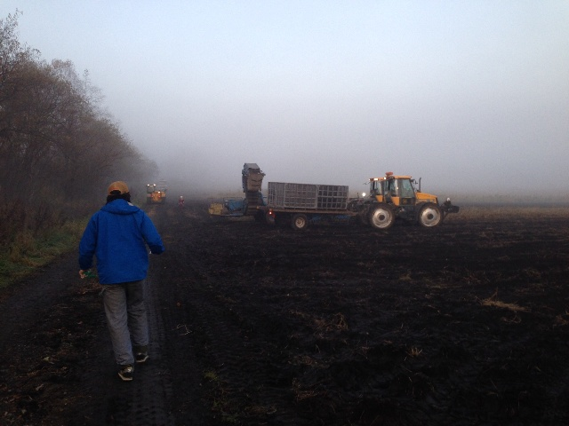
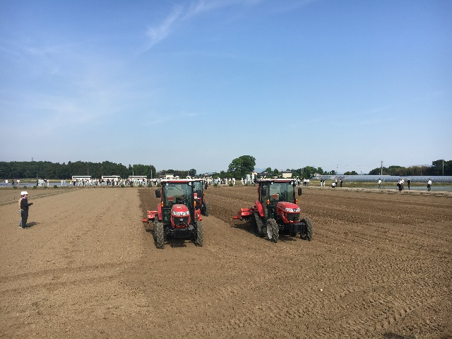

# AgMachine リポジトリへようこそ

Latest or oldest information of agricultural machinery

最新・旧式の農業機械の情報を格納しているレポジトリです．

# Objectives
生産者の方々に，機械開発,特に農業機械開発に携わっている方々に，機械オタクたちに，役立つ情報を提供したいと考えています．

# Quick Link

# 記
- [北海道開発](./ag/kaihatsu/README.md)
- [積年良土](./blog/sekinen.md)

## 国
- [タイ](ag/Thailand)
- [ブラジル](ag/Brazil)
- [オーストラリア](ag/Australia)

## メーカー
- [John Deere](ag/deere)
- [モロオカ](ag/morooka)
- [Caterpillar](ag/cat)
- [claas](ag/claas)

## 用途
- [レベラー](ag/landLevel)
- [スペードブレードローラー](ag/landHarrow)
- [開拓/LandClearing](ag/landClearing)

# blog
考えたことやメモなど．
- [農業機械の進化について](./blog/230804.md)
- [乗用田植え機の変遷について1](./blog/230913.md)
- [バーティカルなソーラーパネル](./blog/230914.md)
- [日本の農業機械はなぜ秒速](./blog/231018.md)
- [連作障害を回避したい](./blog/240723.md)
- [オーガーとドレーパー](./blog/241116.md)
- [アメリカのクイックヒッチ](./blog/241118.md)
- [Claas india の機械とヤンマー](./blog/250324.md)
- [CFX750からAPV5.2に速度信号を流せるか。](./blog/250404.md)
- [CFX750からAPV5.2に速度信号を流すための準備](./blog/250407.md)
- [CFX750からAPV5.2に速度信号(最終回)](./blog/250422.md)
- [古いスガノ(私のDNA)](./blog/250418.md)

# snow
除雪もまた，筆者の興味の方向の1つ

[除雪のページ](./snow/)

# manual
このリポジトリにはおもすぎて載せられないpdf や機械の使い方などをまとめています．

- [小麦コンバイン(notionへ)](https://takam1602.notion.site/71285afa237b4355bffca9ee7caa2e40?pvs=4)
- [Agmachine Google Drive(制限あり)](https://drive.google.com/drive/folders/1WD1pjh7rZXmn-130f_GEQYSJrFKsjQwi)
