# Caterpillar
※ 日本のchallenger については[こちら](./challengerJP.md)
今は亡き，Challenger Tractor について深堀する．

## Track Tractor 

トラクターの歴史については、
[bigtractorpower氏の動画1](https://www.youtube.com/watch?v=hEjiFfajYf0)
や
[bigtractorpower氏の動画2](https://www.youtube.com/watch?v=nEWKNSJCdR0)
や
[氏のブログ](http://www.bigtractorpower.com/caterpillartractors.htm)
によく語られてる．

最も、詳しい記事は、2014年のGrainewsの記事だろう。
- [How engineers developed the rubber-belted tractor 1](https://www.grainews.ca/machinery-shop/how-engineers-developed-the-rubber-belted-tractor/)
- [How engineers developed the rubber-belted tractor 2](https://www.grainews.ca/machinery-shop/how-engineers-invented-the-rubber-belted-tractor-for-ag/)

それぞれの記事の翻訳は[こちら](./grainews_2014.md)

### Caterpillar 社のトラクタ
#### 要約
- Holt 社とBest 社のトラクタでアメリカを開拓したところから．
- 20世紀半ばから，建設業界へシフト．農業機械の専業メーカーではなくなる．
- 1987年にchallenger 65 を発表，農業機械業界に再び参入
- 2002年春にAgco へchallenger の販売・製造を移譲，caterpillar は再び農業業界から手を引く．
#### 農業用トラクタの開発過程
先程のGrainnews の記事が最も詳しい。
他の写真も掲示板に流通してしまっている。
[newagtalk](https://talk.newagtalk.com/forums/thread-view.asp?tid=274454&DisplayType=flat)
- 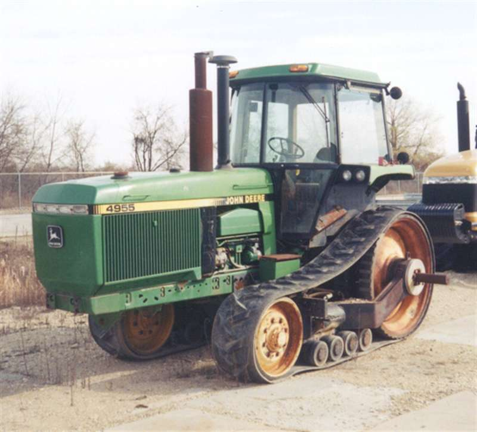
- 
- 
- 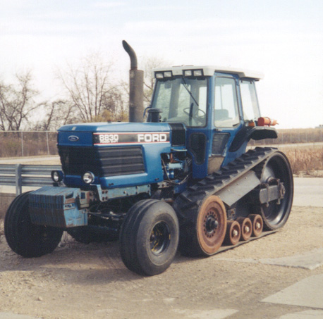
- 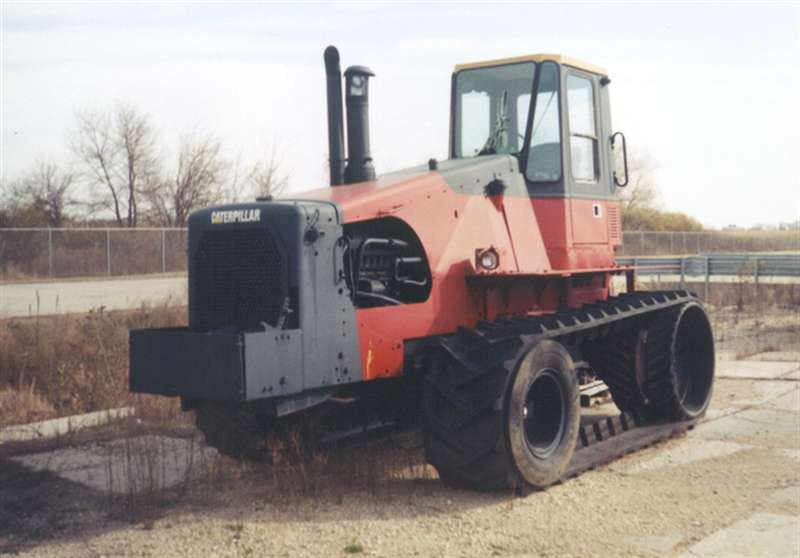
- 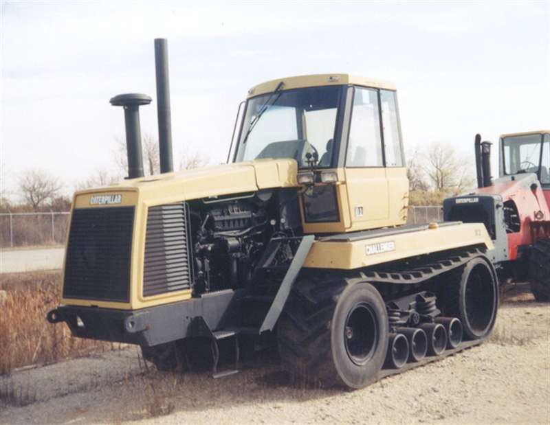

様々な試作・開発工程があって、65が出来上がった。

### 農業用トラクタ

1987年, Challenger 65が市場初となる，ゴムクローラトラクタ(Rubber Track Tractor)が発表．
オーロラ工場で最初の65を生産した後、イリノイ州のディカルブで生産sされた。
ディカルブにあったトラクター工場は，2002年にCat が農業用トラクターをAGCOに売却し，2003年にAGCOがミネソタ州ジャクソンに工場を移転するまで，16年ほど稼働をした．

#### Davenport plant
最初の、65の組み立てを行った/行う予定だった工場。
[ebay で売られていたDavenport の帽子](https://www.ebay.com/itm/267031413235)
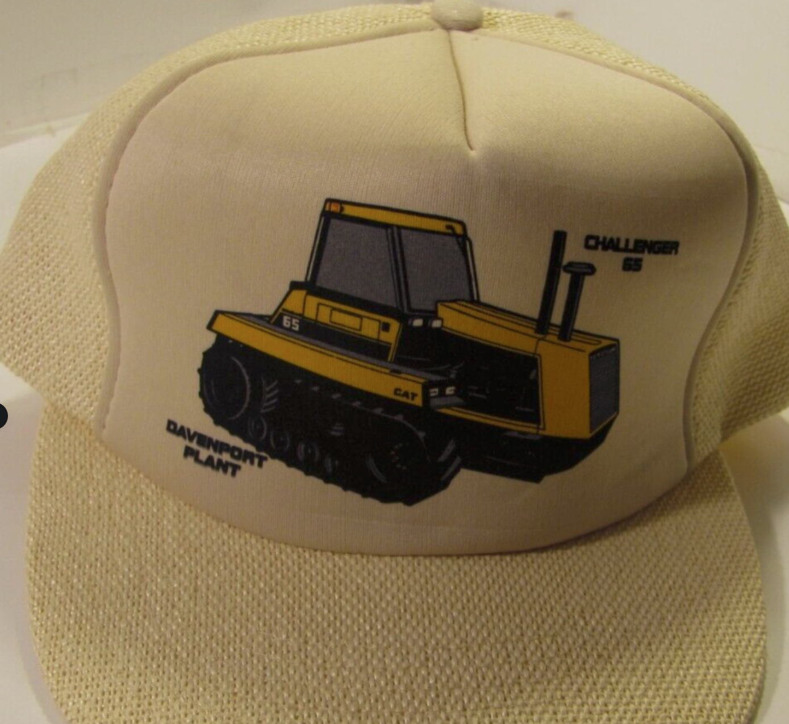

1987年1月15日の[記事](https://www.chicagotribune.com/1987/01/15/caterpillar-to-close-3-plants/)では、
Davenport plant で65の製造が計画されていた、と記載がある。

#### Aurora plant
[map](https://maps.app.goo.gl/84Z6hHwccu5rgyEEA)

Davenport で製造がなされたのか、どうなのかわからないが、Aurora plant で製造は計画されたそうだ。
[Caterpillar decided to close its Davenport plant](https://www.latimes.com/archives/la-xpm-1987-02-18-fi-2621-story.html)
L.A. Times Archives
Feb. 18, 1987 12 AM PT

Employees at the Iowa facility were informed that the company plans to shift products made at Davenport to Caterpillar plants in Aurora, East Peoria and Mossville, Ill.
D6H track-type tractors will be assembled at the East Peoria plant. 
The new Challenger 65 agricultural tractor will be assembled at the Aurora plant. 
Davenport Production will be phased out over a number of months.

ということだそうだ。
Davenport のデザインと全く同じ,[ebay で売られていたAuroraの帽子](https://www.ebay.com/itm/296219555854)
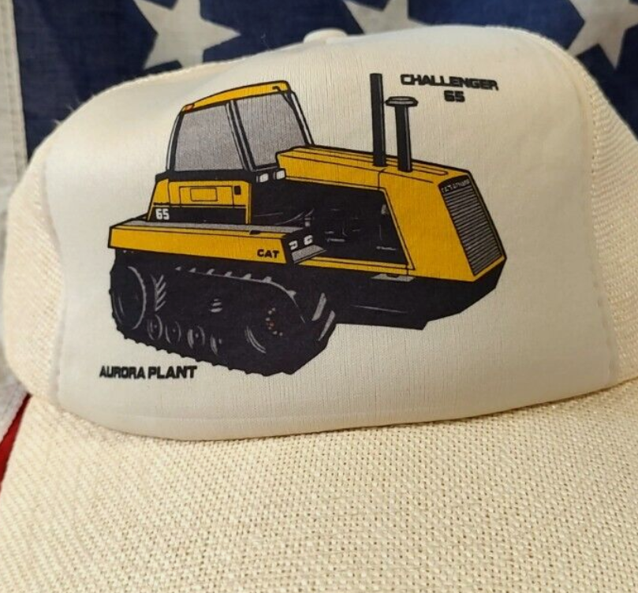
もある。

[Caterpillar introduces tractor with new rubber track design](https://www.postbulletin.com/caterpillar-introduces-tractor-with-new-rubber-track-design)
に書いてあるように、75はAurora plant で組み立てされたらしい。
そして、肝心の、MTSはペオリアで製造されたと書いてある。

PEORIA, Ill. (AP) -- Caterpillar Inc. is sinking its roots a little deeper in the agriculture equipment market by building a bigger version of its farm tractor.

The Challenger 75 is an enhanced version of a smaller Challenger 65 and boasts bigger engine, more horsepower and greater productivity.

People make their purchasing decisions for spring in the fall,'' said William Reno, senior consultant with Caterpillar's agriculture machinery unit. We've had an excellent response at shows and initial dealer orders have been extremely gratifying.

The new Challenger features rubber tracks, called the Mobil-trac System, instead of traditional round tires on most farm equipment.

Caterpillar said the rubber track spreads the tractor's weight more evenly and causes much less soil compaction than traditional tires on four-wheel-drive tractors.

The company said the tracks also offer enhanced traction and mobility in muddy fields than tires, which bog down in wet conditions.

Although the new tractor is bigger than the original Challenger, which debuted in 1987, it is about the same weight.

Caterpillar is hoping a new, larger version of its successful farm tractor, the Challenger 65, will help fulfill the company's renewed commitment to the agriculture equipment market.

A Challenger 75 prototype worked the fields of Norris Farm east of Lewistown last spring, convincing operations President Jerry Moss the new tractor has a role in his enterprise.

We are very well-pleased, he said. We will probably work our way gradually to the 75.

Gillett Agricultural Management Co., which runs Norris Farm, has four of the smaller Challenger 65s.

Moss said the more costly Mobil-trac System on the Challenger 65 paid for itself in one year because of increased yields.

Caterpillar calculates the Challenger 75 would increase corn yields by six bushels an acre. On a 1,000 acre farm with corn at $3 a bushel that would amount to an additional $18,000 a year in profits -- half the cost of the Mobil-trac System.

Challenger's debut in 1987 represented Caterpillar's recent return to the agriculture market.

Adding the second model line demonstrates Caterpillar's commitment to the agriculture industry, Reno said. We've always seen the Challenger family with three products in the model line and we have not changed our thinking. The third tractor would be smaller.

The Springfield-based Capitol Machinery Co., carries the Challenger 65 and expects delivery of the Challenger 75 in March.

Bob Beatty, Capitol's sales manager, said list price for the Challenger 65 is $140,000 and the Challenger 75 is $161,000.

The rubber tracks now are being tested on a self-propelled forage harvester, a municipal sludge spreader in the Northeast and sugar cane harvesters in Florida and Hawaii.

Production on the Challenger 75 begins this month at the company's Aurora plant, but the company doesn't anticipate increasing employment to accommodate the new line.

The tractor's Mobil-trac System is assembled in Peoria-area facilities.

[65B と65Cのネブラスカテスト](https://digitalcommons.unl.edu/tractormuseumlit/1963/?utm_source=digitalcommons.unl.edu%2Ftractormuseumlit%2F1963&utm_medium=PDF&utm_campaign=PDFCoverPages)

65Cはどこで生産されたかわからない。

[Auroraプラントの閉鎖](https://www.rermag.com/news-analysis/headline-news/article/20951901/caterpillar-to-shut-aurora-ill-manufacturing-facility)
[Aurora プラントは2018年に閉鎖されてしまった](https://www.reuters.com/article/business/caterpillar-shuts-plant-in-aurora-illinois-that-employs-800-idUSKBN17332L/)

#### Dekalb plant
おそらく65Dの製造から、ここ。
[65Dのネブラスカテスト](https://pruefberichte.dlg.org/filestorage/CATERPILLAR-CHALLENGER_65_D_Nr1614_1996-englisch.pdf)

65Dからは、イリノイ州のディカルブにある工場で組み立てされていた．ディカルブにあったトラクター工場は，2002年にCat が農業用トラクターをAGCOに売却し，2003年にAGCOがミネソタ州ジャクソンに工場を移転するまで，16年ほど稼働をした．

- [google map](https://www.google.com/maps/place/CEVA+DEKALB/@41.9527044,-88.712512,981m/data=!3m1!1e3!4m6!3m5!1s0x880f2b4b0cb22b4b:0x95792b28b2230e93!8m2!3d41.9525604!4d-88.7129211!16s%2Fg%2F11h5q0c0dx?entry=ttu&g_ep=EgoyMDI0MTEwNi4wIKXMDSoASAFQAw%3D%3D)
12101 BARBER GREENE RD., DE KALB, IL 60115 

ディカルブの工場は，flat belt tractor を主に製造していた．

2003年にAGCOの工場が閉鎖されるまで，そこでトラクタが作られ続けていたが，現在は運送会社の持ち物になっている．
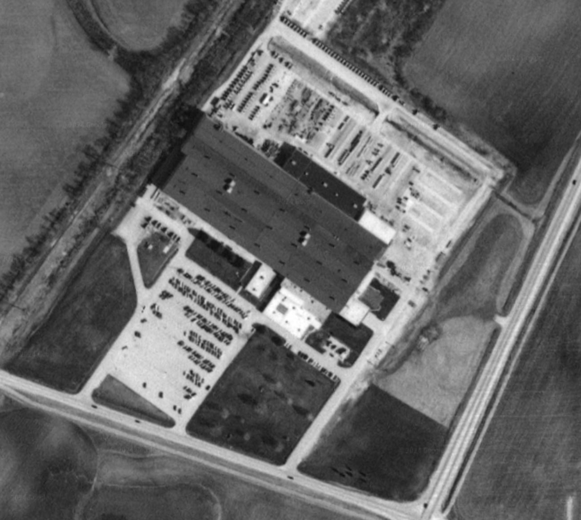
Goolge earthの1999年のスクショ．上側にトラクタらしきものが並んでいるのが見える．

#### Manitoba plant (New Holland Versatile)

[bigtractorpower氏の動画2](https://www.youtube.com/watch?v=nEWKNSJCdR0)
の翻訳．

高馬力なflat belt tractor の売れ行きが好調な一方で，軽量でトラック幅が可変なrow-crop tractor の需要が高まった．
そこで，1995年に，初めて, 35,45,55と行った，triangle belt tractor を発表した．

このトラクターは，一からCaterpillar が設計・製造したのではなく，当時NewHolland が発表していたGenesiss トラクターをベースに製造したものだった．

Dekalb ではなく，Manitoba 州のWhinipeg にVersatile が工場を所有していたため，そこで製造していた．
ということで，35, 45, 55 はカナダ製ということになる．
[ウィニペグの工業団地にある工場](https://maps.app.goo.gl/bvpchyrUVLgSyo589)

1998年まで製造していた，というサイトがいくつかあるが
[Tractor Data](https://www.tractordata.com/farm-tractors/tractor-brands/challenger/challenger-tractors.html)
[2001年製造？のCH45](https://www.equipmentfacts.com/listing/auction-results/228289373/2001-caterpillar-ch45-175-hp-to-299-hp-tractors)があったり，そのPINはcaterpillar のパーツカタログサイトで検索に引っかかる．
[パーツカタログ](https://parts.cat.com/en/catcorp/parts-diagram?systemId=00000300&componentId=00000309&ieSystemControlNumber=SEBP28610336)

このことから，1998年でWinnipeg で生産を終了したあともDekalb で製造していたのでは疑惑がある．

また，2000年に35,45,55 のカタログが発行されていたことからも，Winnipeg かDekalb で製造していたとおもわれる．
 [ebay のカタログ](https://www.ebay.com/itm/373845563568)
 や
 [ebay のカタログ](https://www.ebay.com/itm/174921454787?_skw=Caterpillar+Challenger+35%2C45%2C55&itmmeta=01JD7NZR2VSJEA0F13GSWHJBFE&hash=item28ba2194c3:g:vD8AAMXQq8BQ7X4C&itmprp=enc%3AAQAJAAAA4HoV3kP08IDx%2BKZ9MfhVJKnYPiz4yyLoTjI6oEOvwL2s%2BWJl3%2B3t4CJBA%2B0g370V%2FPrF1C6bQWjc2XBA4h5hKT5jig6c2cALmD0ooa3P%2BmA9cIlfB9OG2Z1IQN3CJRyA6e810bcQ9nWuBzimaTEKzTQeHYGbBS1z84qig7uJdwJ%2FyNp1wwkozpZnHpxs728TQOoCfMeQDb1sJ34F7UDnOaI9X%2Bj0eF8YZH7m4svcskOrTwuh7VvivIhiaBmfeI3we%2FK6qdMSKXnWz89ZEN74T9j4I%2FedbaIr%2FKEeAyQ%2FYStQ%7Ctkp%3ABk9SR8SB__XpZA)

 このような，2000年前後にもtriangle belt tractor があったということは，dekalb でしょう．

 Versatile 公式は，Genesiss tractor を作っていたことや，CH35~55を作っていたことを[公言している](https://www.versatile-ag.com/NA/pages/newsletter_04-03.php)けど，製造は1998年まで，と書いている．

 やっぱり，Winnipeg では1998年まで作っていて，そのあとはDekalb で作っていた，ということなのではなかろうか．
 そういえば，Chaterpillar chroniclの本や[Big Tractor Power氏のブログ](http://www.bigtractorpower.com/caterpillartractors.htm)でちらっと写っている背景のトラクターたちは，おそらくEシリーズで，1998年くらいに撮影されたものと思われる．
Triangle Belt Tractor は見つからないが...

色々検索していると，Camso のカタログが見つかった．
[カタログ](https://www.dandjfarmsupply.com/pdfs/Cat_Track_Reference_Guide.pdf)
には，CH35~55は1994年から2001年まで製造と書いてある．
やっぱりそうだ．

てことは，1999~2001年まで，Delakb で製造していたに違いない．
後期のRow-Crop Challenger のプレートはEシリーズと同じであることから，そう，推測した．

カナダ製とアメリカ製，正確には組み立てが異なるということだろうか．
[combine forum の記事](https://talk.newagtalk.com/forums/thread-view.asp?tid=150422&DisplayType=nested)
でも，シリアルナンバー関連の話題で，Dekalbに移したあとは，シリアルナンバーの表記が変わったかもしれないとの発言がある．

[95E の動画 ](https://www.youtube.com/watch?v=-z4n0nUdUvE)
を眺めてると3分20秒くらいとのところに，CH55みたいなのが写っている．これは決定的だろう。

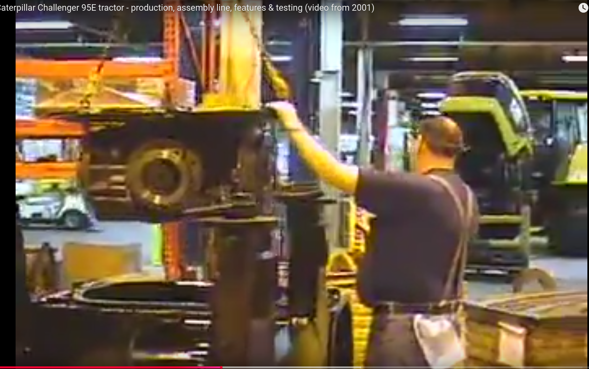

8分3秒くらいからは，結構やばいのいっぱい写ってる．
CH35, 45かのTriangle Belt も[写ってる](./img/chRowCrop_outside.png)
し，なによりプロトタイプが結構[写ってる](./img/ch_prottype.png)．

映像から，2002年3月くらいまでの，caterpillar がトラクターを作り終えるまでの期間であっても，CH35, 45, 55 はWinnipeg からDekalbで製造していただろう，裏付けが取れた．

##### 決定的なFarmers weekly の記事
35, 45, 55 はWinnipeg の工場で生産が終わったのか論争(そんなのないけど)について、決定的な記事が見つかった。
[1999年4月のファーマーズウィークリーの記事](https://www.fwi.co.uk/news/going-to-grounds)
によると

Going to grounds… 9 April 1999

Rubber-tracked Cat production switches to US

By Peter Hill

US agricultural and construction equipment giant Caterpillar has moved production of its three smaller Challenger rubber track tractors to its own plant in the US.

Since the mid-size tractor was launched in 1994, the Challenger 35, 45 and 55 (now sold in Europe in Claas colours) have been assembled under contract at New Hollands Versatile factory in Winnipeg, Canada. This was a logical arrangement, given the extent to which major components are shared with New Hollands G/70 series tractors.

But the "little Cats" are now being put together at Caterpillars DeKalb, Illinois, facility where the larger Challengers have been assembled for more than four years.

The US plant also makes Caterpillars VFS (Versatile Flotation System) tracked trailers and "chaser bins", so the move concentrates the companys current farm tractor activities in one location, and saves shipping built-up Mobil-trac undercarriage assemblies to Winnipeg.

Since the company will continue to source components from New Holland (principally the cab and transmission/hydraulics assemblies), few changes result from the move, although Caterpillar has taken the opportunity to upgrade the specification of models now coming off its own assembly line.

Chief among these is a 38% increase in hydraulics oil flow from 120 to 163 litres/min (26 to 36 gal/ min), with an accompanying boost in maximum system pressure from 189 to 200 bar (2750 to 2900psi).

The model 55 benefits from increased maximum power output and greater torque back-up and an improved 60 degree chevron pattern for the drive wheel.

Shortening the rear hitch brings implements 100mm (4in) closer to improve balance and increase effective lift a touch, while revised front weights (similar to E series Challengers) are said to provide a simpler but more efficient counter-weight arrangement. &#42

Caterpillar has moved production of its smaller three Challenger models (sold in Europe under the Claas name) from New Hollands Winnipeg plant in Canada to its own facility at DeKalb, Illinois, USA.

詳しい情報が書かれている。
結論から、やっぱりWinnipeg からDekalb に1999年に移っていた。
そして、やっぱり、Winnipeg で生産されていたchallenger とDekalb に移ってから生産されていたchallenger は仕様が異なるようだ。

具体的には、
- 油圧流量が38% 増加、
- 油圧最大圧力が189->200bar に引き上げ
- 55はエンジンの改良、シェブロンパターンホイールのオプション
- リアヒッチの短縮
- フロントウェイト(Eシリーズに類似)を装着
などのようだ。

日本のチャレンジャーはどちらだろう。

#### なくなる直前: 2001年8月17日のCaterpillar 社のページ
[way back machine ありがとう](https://web.archive.org/web/20010817194614/http://caterpillar.com/industry_solutions/agriculture/01_new_equipment/_products/rowcrop.html)

Challenger® Row-Crop Tractorsが[2001年8月当時のHP](./200108_ch354555.md)にも登場していた。

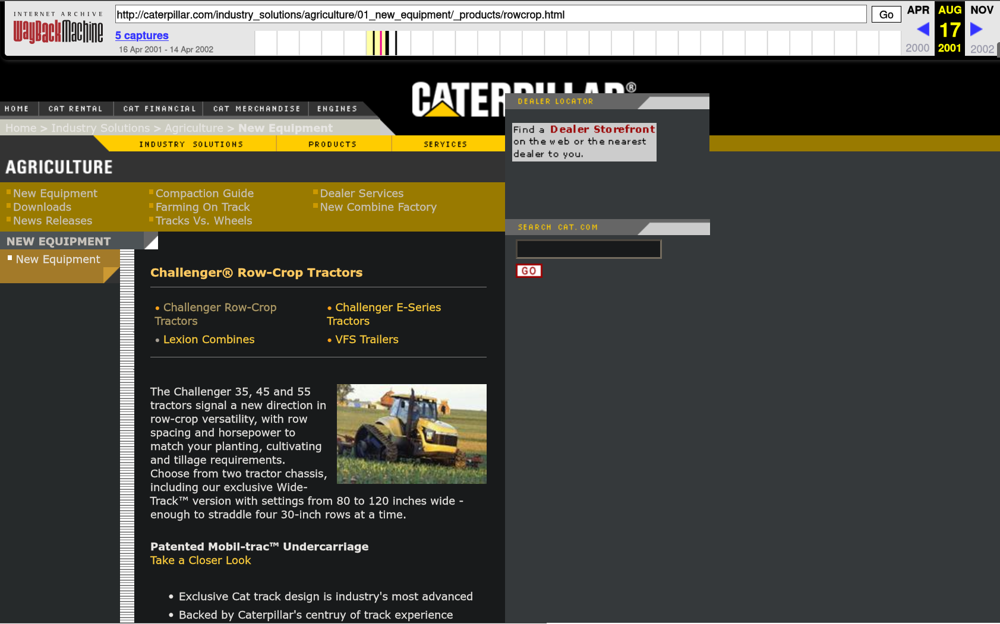

度々見るロゴマークはこれ。

### トラクタ製造の終焉

- [2001年12月17日のプレスリリース](https://web.archive.org/web/20021006044325/http://caterpillar.com/about_cat/news/01_corporate/getprdata.html?file=newscorp008592606.dat&callingdoc=/about_cat/news/01_corporate/corporate.html)

Press Release
December 17, 2001 	

Caterpillar and AGCO Reach Agreement To Add Next Generation of Challenger® Tractors to AGCO Product Line

AGCO to acquire Design, Assembly, Marketing
As Cat Focuses on Engines, Drivetrain, Other Major Components

PEORIA, Ill., and DULUTH, Ga. -- Caterpillar Inc. (NYSE: CAT) and AGCO (NYSE: AG) have signed an agreement for AGCO, a Georgia-based agricultural equipment manufacturer and distributor, to acquire the design, assembly and marketing of the new MT Series of Caterpillar's Challenger® high-tech farm tractors.

"Caterpillar has a long history of designing and producing rugged, reliable agricultural machines, and this industry continues to represent an important growth opportunity for us," said Robert Macier, Caterpillar vice president with responsibility for the company's Diversified Products Division. "This agreement enables us to focus our efforts on those areas where we can add the highest value - engines, drivetrains, electronics and technology development - while AGCO provides its expertise in the assembly and marketing of agricultural products. It also offers Caterpillar the opportunity to provide additional engines and other components to AGCO - one of the leading global suppliers of agricultural equipment."

Macier noted that Caterpillar already is a major engine supplier to AGCO, which is one of the largest customers of Caterpillar's Perkins Engines division.

John Shumejda, President and CEO of AGCO said, "This new and innovative tractor technology gives AGCO a leading entry into the broad-acre 'corporate' farm market segment. In addition, AGCO will provide Caterpillar dealers with additional products that will broaden their equipment offerings and enhance their competitive position in the agricultural equipment market."

AGCO is a multiple-brand producer with a full agricultural product line that is sold throughout the world under brands that include Massey Ferguson and Fendt.

"Adding these outstanding Caterpillar machines to our brand line-up puts AGCO in a strong position to respond to the growing customer need for high-horsepower track-type tractors that can maintain more efficient traction under full loads than conventional rubber-tire tractors of similar size," Shumejda said. "The versatile new MT Series not only addresses that need, but provides the latest technology to tackle a wide variety of farming applications."

Under the agreement, Macier and Shumejda said, AGCO will immediately begin assembly of four models of the newly announced MT700 series of Challenger tractors. It also calls for Caterpillar to be a long-term supplier of high-horsepower (220-500 hp) diesel engines, drivetrains, and other major components, including the patented Mobil-trac™ system, with its rubber tracks that enable more efficient utilization of engine power with less soil compaction. This agreement also includes future MT Series tractors.

AGCO will acquire the MT Series product design, and will continue to market the tractors through Caterpillar dealers worldwide, as well as through a selected network of AGCO dealers. Caterpillar will provide technical support to AGCO on track technology and will maintain customer support services for all Challenger tractors produced prior to the sale of the MT Series to AGCO.

The parties have agreed not to disclose financial terms of the transaction, which is expected to close in the first quarter of 2002.

In conjunction with this transaction, Caterpillar will take a pre-tax charge of about $80 million. Excluding this charge, the company is still comfortable with the 2001 outlook released with its third-quarter results.
About Caterpillar:

Caterpillar Inc. is the world's largest manufacturer of construction and mining equipment, diesel and natural gas engines, and industrial gas turbines. Headquartered in Peoria, Ill., the company posted 2000 sales and revenues of $20.18 billion.
About AGCO:

AGCO Corporation, headquartered in Duluth, Georgia, is a global designer, manufacturer and distributor of a full line of agricultural equipment and related replacement parts. AGCO products are distributed in 140 countries through more than 7,500 independent dealers and distributors. AGCO products are distributed under the brand names AGCO, AGCOSTAR, Ag Chem, Farmhand, Fendt, Glencoe, Gleaners, Hesston, Massey Ferguson, New Idea, Tye, Spra-Coupe, White and Wilmar. In 2000 AGCO had sales of $2.3 billion. 

ということで，2002年の第1期までに，cat のプラントはAGCOに引き渡されたことになった．

- [2001年12月21日のFarmers weeklyの記事](https://www.fwi.co.uk/news/challenger-rights)
によると、

Challenger rights

21 December 2001

JUST weeks after the launch of a new generation of "small" Challenger tracked tractors, Caterpillar has decided to sell all rights to rival AGCO.

The surprise deal, under which AGCO acquires all design, assembly and marketing rights for the 235hp to 306hp Challenger MT series, gives AGCO a leading entry into large-scale farms in North America.

In Europe, it places a question-mark over the future role of Claas in the distribution of these machines.

The tractors were due to have been launched in Claas colours at the Agritechnica exhibition in November but failed to appear at the last minute.

"We have been in deep discussions with Caterpillar for a long time," says Clive Last of Claas UK. 
"As far as we are concerned, no decision has been taken to change distribution arrangements in Europe."

と、Small challenger(MT7シリーズ)の発表の1週間後に、AGCOに全てを売却することを発表したとされている。

Way back machine で調べると，[農業機械部門の製品紹介ページ](http://www.caterpillar.com/industry_solutions/agriculture/agriculture.html)について，

[2002年4月3日の魚拓](https://web.archive.org/web/20020403005731/http://caterpillar.com/industry_solutions/agriculture/agriculture.html)
では，まだ見られるが，
[2002年10月19日の魚拓](https://web.archive.org/web/20021019052327/http://www.caterpillar.com/industry_solutions/agriculture/agriculture.html)
では見られない．
おそらく，予定通り，2002年の第1期, 4月か5月でAgco に全て移管したということだろう．

[1st Quarter の報告書](./pdf/1q02_cat_inc.pdf)と
[2nd Quarter の報告書](./pdf/2q02_cat_inc.pdf)
も一応乗っけておく．

- [2002年3月29日のFarmers weekly の記事](https://www.fwi.co.uk/news/agco-wraps-up-challenger-deal)
でも、AGCOが完全にcat のchallengerビジネスの買収が完了したことが報告された。

- [CATに関する最近の記事](https://www.producer.com/crops/why-did-caterpillar-sell-off-the-challenger-line/)
chat GPTによる要約
キャタピラーが2002年にチャレンジャーシリーズのトラクターをAGCO社に売却した背景には、いくつかの戦略的な理由がありました。主な要因は、建設機械市場の停滞で収益が減少していたことです。キャタピラーの当時のCEOであったグレン・バートン氏は、会社が建設部門での主要製品に十分な投資を行えていない一方で、農業部門には多くの資本が投入されていることに懸念を抱いていました。

キャタピラーの農業部門はジョン・ディアやケースIHと競合していたものの、ディーラーネットワークは農業市場に特化しておらず、競争力が不足していました。農業市場での競争を維持し、リーダー企業と渡り合うには、農業専用のディーラー網の拡大やさらなる資本投資が必要でした。しかし、会社全体の投資資金は限られており、農業部門への資金集中が他部門に悪影響を与えるリスクもあったため、キャタピラーはチャレンジャーシリーズの売却を決断しました。

まあしゃあなし．

- [2002年9月のAGCOの記事](https://investors.agcocorp.com/news-releases/news-release-details/agco-provides-update-challenger-product-line-distribution-0)
では、ちゃんと販路を拡大していることがわかる。 [記事コピー](./20020923_agco.md)

- Dekalb では、AGCOの工場が閉鎖されてから，3MのプラントDK2でもあった．
- [こういう，北イリノイ大学の学生新聞の記事](https://northernstar.info/65445/news/city/new-commercial-property-soon-to-be-developed-part-of-dekalb/)

に情報がまとめられていたから，こういう情報にアクセスできた．
素晴らしい．ありがとう，当時の北イリノイ大学の学生, Shivangi Potdarさん．

- [AGCOの，Dekaulb 工場閉鎖のプレスリリース](https://investors.agcocorp.com/news-releases/news-release-details/agco-plans-close-dekalb-ill-plant)

新しい移転先はMinnesota州のJacksonというところ。: AGCO Jackson Operations, 202 Industrial Pkwy, Jackson, MN 56143, United States
[AGCO Jackson](https://maps.app.goo.gl/fcCusefAGtbMQTGv7)

隣にcat のdelaer Ziegler がある。
[Ziegler Jackson](https://maps.app.goo.gl/W6rWSYMZoebFuZ8L7)

- [Jacksonに移ってから](https://web.archive.org/web/20060823121345/http://www.agcocorp.com/default.cfm/PID=1.7.5)

In 2002, AGCO Corporation acquired Caterpillar, Inc.’s agricultural equipment business, primarily the design, assembly and marketing of the Challenger brand track tractors. The revolutionary track system utilizes tough rubber tracks and an innovative suspension system, offering professional farmers the traction and flotation of steel tracks combined with the ride and speed of rubber tires.

Using revolutionary designs and groundbreaking technology, Challenger products combine high specifications with superior reliability.  Other Challenger brand equipment has also been developed to meet customer needs and enhance dealer product offerings and service, including combines, hay tools and compact tractors.. 

Challenger equipment is marketed through a growing network of Challenger dealerships worldwide.

For more information, please go to www.challengerag.com 

ということで、元気そう。

- [2004年6月7日のAGCO](https://web.archive.org/web/20040607035313/http://www.challenger.agcocorp.com/)
Going Forward With New Products
and Better Ideas...

Since 1987, when Caterpillar® introduced the world’s first farm tractor equipped with rubber tracks, the Challenger® name has stood for awesome power, cutting-edge technology and amazing versatility.  However, the Challenger name acquired even more significance in 2002, when the Challenger tracked tractor line was acquired by AGCO Corporation.

Today, Caterpillar dealers continue their dedication to the farming community with a full line of agricultural products, many of which are specifically designed and built by AGCO to carry the Challenger logo. At the same time, the majority of the engines used in Challenger products, along with tracked tractor powertrains, are built by Caterpillar, making it a win-win situation... particularly for customers.

Thanks to the unique corporate partnership, the agricultural lineup available under the Challenger banner is currently comprised of wheeled and tracked tractors from 23 to 500 horsepower, combines, implements and a full line of hay equipment, including windrowers, mower-conditioners, balers and disc mowers. All are sold, serviced and backed by the legendary network of world-class Caterpillar dealers.

See your local Caterpillar dealer soon and learn how Challenger is Going Forward in the 21st Century. 

この時代の[カタログたち](./2004_challengerBrochure.md)

ということで、脈々とchallenger シリーズが量産されていく。

## 近年のchallenger
Agco に渡ってからは，challenger シリーズは開発が続けられてきた．

今も機械・工場自体は稼働してるが，challenger ブランドはAGCOの中からは消えてしまっている．
Fendt ブランドに統合されてしまった．

[2020年3月には掲示板で話題になっていた．](https://www.allischalmers.com/forum/agco-discontinuing-the-challenger_topic169223.html)

[2021年の記事](https://www.grainews.ca/equipment/agco-updates-the-mt800-challenger-tractors/)
には，詳しく書いてあって，

“Of course, when you talk about a brand disappearing in public, then dealers are upset and all the owners of a product would also be upset. So, let me answer that as follows: Challenger is the exclusive brand for Caterpillar dealers in North America. It is not used elsewhere. In Europe, we already excluded the brand from our range. And the Challenger dealers in the United States are also sales partners with Fendt. So, this means my answer to the question is, it is a very good question. Can we move on to the next one.”

とめちゃくちゃぼかしている．
明言はしなかったけど，まあ，Challenger はなくなって，Fendt のtwo-belted tractor になってった，ということだろう．

challengerシリーズのトラクターが
[retail-only](https://www.agequipmentintelligence.com/articles/4831-agco-implements-retail-only-model-for-challenger-brand?v=preview)
になってったことも，明言はしていないが，その答えだろう．

2024年11月15日現在[challengerトラクタのページ](https://www.agcocorp.com/brands/challenger.html)
に飛ぶと，勝手にFendt のページやMFのページに飛んでしまう．

魚拓を眺めると，
[2024年9月15日](https://web.archive.org/web/20240907100722/https://www.agcocorp.com/brands/challenger.html)
にはまだあったけど，2024年11月にはないということは2024年3q でchallenger ラインは完全にgreen fendt 化しており，yellow は排除されたということだろう．

すなわち，2024年10月に，cat から引き継いだYellow spilits なるものは，消えてしまったということだ．
[Fendt Vario MT](https://www.fendt.com/int/agricultural-machinery/tractors/fendt-1100-vario-mt)

2024年11月15日現在，terragator はまだ黄色であり，rogator はもうfendt になってしまっている．
[terragator, rogator ](https://www.applylikeapro.com/)

みごとに数年(10年くらい)かけて，Phasing out していったことになる．

## Cat とClaas

- [1997年2月21日](https://www.fwi.co.uk/news/joint-deal-opens-doors-for-claas-and-caterpillar)
Joint deal opens doors for Claas and Caterpillar

- [1999年6月4日のfwi](https://www.fwi.co.uk/news/rubber-tracks-tough-enough-for-road-and-field)
Rubber tracks tough enough for road and field

- [1999年10月1日のfwi](https://www.fwi.co.uk/news/revisions-at-rear-end-of-challenger-crawlers)
Revisions at rear end of Challenger crawlers

- [2000年2月25日のfwi](https://www.fwi.co.uk/news/caterpillar-takes-over-claas-teleporter-plant)
Caterpillar takes over Claas teleporter plant

- [Claas celebrates... ](https://www.claas.com/en-us/press/press-releases/2024-06-13-claas-celebrates-half-a-million-combine-harvesters)

    - A colorful start in North America

        Over the years, many of combines made their way onto US and Canadian farms under different names and in different colors. 
        From 1960-1970, CLAAS was the OEM responsible for the production of the blue FORD 622 and 642 combines available for sale throughout North America.
        In 1989, CLAAS signed an agreement with Massey Ferguson where the DOMINATOR 98 and 108 where available in Massey Ferguson red and known as the MF 8450 and 8460.
        In 1997, CLAAS and Caterpillar formed a joint venture to manufacture and retail LEXION combine harvesters together.
        While the LEXION name was retained, it was the Caterpillar brand that dominated the machine with the Caterpillar (and later, CAT) name on the side and Caterpillar yellow and black paint.

    - International production network

        Since 1992, CLAAS combine harvesters have no longer been manufactured exclusively at the Harsewinkel, Germany headquarters. 
        That year, the first CLAAS CROP TIGER rolled off the assembly line in India, of which more than 10,000 units were produced.
        Since 2001, CLAAS has also been producing LEXION hybrid combine harvesters for the North American market in Omaha, Nebraska. 
        Shortly after opening as a joint venture between CLAAS and Caterpillar, CAT exited the market and CLAAS took full ownership of the production facilities.
        North American LEXION combines – many of which continued to be sold through Caterpillar dealers – retained the CAT yellow and black color scheme until 2019.  

- [farmprogress](https://www.farmprogress.com/farming-equipment/pioneering-claas-combine-factory-celebrates-25-years)

## Tillage Equipment
1番マニアックな機械の項だとは理解しているが，情報があまりにも少なすぎて，毎回検索するのが大変なので，ここにまとめて記す．

- [当時の記事(2000年11月9日(ちょうど24年前!!))](https://www.farmanddairy.com/news/krause-to-make-tillage-tools-for-caterpillar/3671.html)
DEKALB, Ill. – Caterpillar Agricultural Products Inc. will offer a line of tillage tools manufactured by Krause Corporation, Hutchinson, Kan., for use with track tractors.

The new line will include a family of disc rippers and in-line rippers, as well as seedbed finishing tools. Initial availability for the United States and Canadian markets is expected in fall 2001.

Krause will continue to manufacture and market its own line of tillage equipment and grain drills under the Krause brand identity.

The Caterpillar tillage products will be identified with Caterpillar’s signature yellow paint and logo, and will be marketed through Caterpillar’s U.S. and Canadian dealer networks.

- [Who makes Caterpillar rippers](https://talk.newagtalk.com/forums/thread-view.asp?tid=258098&DisplayType=flat&setCookie=1)

All of the CAT tillage tools (ag proper: deep tillage, finishing and discs) were joint products between Krause and Caterpillar Ag Products and sold under the CAT brand; unlike Rome tools, which were aftermarket options only, and not affiliated with CAT whatsoever. 
The CAT tillage tools were introduced in 2001 and died in 2002. 
They were (still are) every bit as good a product as Krause produces with some unique features exclusive to the CAT brand (at the time) like narrow road transport for the folding units to ensure transport width was consistent with the max. 
Row spacing width of Challenger MT 700 and 800 series track tractors and cushion hitches for improved ride quality. 
Nice tools. 
I wouldn't be afraid of them. 
Repair parts readily available via Krause.

- [CAT tillage](https://www.thecombineforum.com/threads/cat-tillage.12987/)

- [2000年11月1日のプレスリリース](https://web.archive.org/web/20010111114500/http://www.caterpillar.com/industry_solutions/agriculture/news_releases/getprdata.html?file=equipmentag972938517.dat&callingdoc=/industry_solutions/agriculture/news_releases/news_releases.html&init_section=equipmentag&origindoc=)

Press Release
November 1, 2000 	Back To Listing

Caterpillar Adds Tillage Tools to Ag Product Line-up

DeKalb, IL - Caterpillar Agricultural Products Inc. has announced that it will offer a line of tillage equipment as an addition to its agricultural product line.

Caterpillar has entered into an agreement with Krause Corporation, Hutchinson, KS, to manufacture a line of Caterpillar® implements optimized for use with track tractors. The new line will include a family of disc rippers and in-line rippers, as well as seedbed finishing tools. Initial availability for the U.S. and Canadian markets is expected in Fall 2001.

The Caterpillar tillage equipment will be identified with Caterpillar's signature yellow paint and logo, and will be marketed through Caterpillar's U.S. and Canadian dealer networks. Krause will continue to manufacture and market its own line of tillage tools and grain drills under the Krause brand identity.

While details of the product offerings have not yet been announced, Bob Strube, president of Caterpillar Agricultural Products Inc., said the new line of tillage tools will have unique features designed to complement the high productivity of the Challenger® tractor line. "These tools will be designed to help producers achieve optimum yields, and improve their bottom line, through better soil management," he commented.

Strube added that this new product line is significant for Caterpillar dealers and customers. "This tillage line expands the opportunity for Caterpillar dealers to provide product and service solutions for agricultural customers," he said. "It builds on the advantages offered by Challenger tractors, Lexion® combines, skid-steer loaders, telehandlers and other Cat® material-handling equipment for the ag industry. We're confident these products will follow in the Caterpillar tradition of providing equipment that sets industry standards for performance, quality and value."

"Our customers and dealers have been asking us to expand our agricultural product line," commented John Pfeffer, vice president of Caterpillar's North American Commercial Division. "We are pleased to have the opportunity to work with a company like Krause, which brings more than 80 years of experience in the design and manufacture of tillage tools. Caterpillar is committed to the agricultural market, and this is another significant step toward our continued growth in that area."

Krause Corporation has manufactured farm tillage equipment since 1916, and is in its third generation of family ownership. Krause's administrative and production facility in Hutchinson, KS, employs 210 people.

In addition to the seven-model line of Challenger tractors, the Caterpillar agricultural equipment line includes seven models of Lexion combines, VFS track trailers for use with grain carts and other implements, and specialized material-handling products. Learn more about Caterpillar Agricultural Products.

- [2001年11月8日のNew Releases 魚拓](https://web.archive.org/web/20011108093447/http://caterpillar.com/industry_solutions/agriculture/news_releases/news_releases.html)

開けないけど，
    - 2001年2月14日: caterpillar Unverils Primary Tillage Tools; Exclusive Features Optimize Tools For Use With Challenger Tractors
    - 2001年8月29日: Caterpillar Introduces New Secondary Tillage Tools 

とある．

プレスリリースが打たれたのがこれくらいの時期だとして，Primary とSecondary のTillage Tools は発表される時期が異なっていたことがわかった．

Primary もたいがいだけど，Secondary に関しては，Agco に移管するまでの半年くらいしかCaterpillar 製品ではなかった可能性がある．大変貴重なのでは．

以上の記事をまとめると，2001年に登場して2002年にはCATは農業部門から撤退したわけだから，1年くらいしか黄色いTillage Tools を見ることが出来なかったということになる．

- [Big Tractor Power さんのTL2 930 ripper 作業風景](https://youtu.be/Z2ynk1qXyx8?si=1EOmNVf5TurZtsXG)

まあレアな機械ですこと．
Cat が製造したのではなく，Krause のOEM

この動画について，Instagram のポストでは，

TL2 930 nine shank in line ripper sub soiling 18 inches deep in Western Kentucky breaking up field compaction. 
Krause manufactured a line of tillage equipment for CAT in the year 2000 including rippers, mulch rippers, soil finishers and field cultivators.

とある．

つまり，2000年に，Challenger というかCat の農業部門がCat を離れる直前まで，Krauseに，
- In-line ripper
- Mulch ripper(Disc ripper)
- Soil finisher
- Field cultivator

を製造してもらっていたらしい．

なるほど，確かに，Eのchallenger になってくると，黄色い作業機で作業している写真がカタログに時たま見られる．
- [camso のカタログ(TL2 730)](https://camso.co/assets/products/specs/pl/ag/1801_AG_BrochureTrackWheel_CAT_8,5x8,5_EN_V11.pdf)
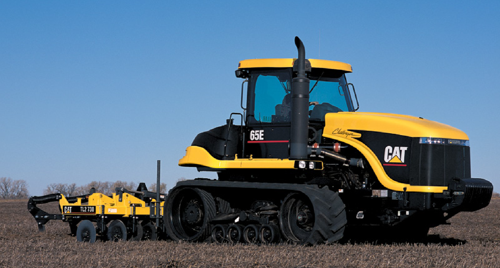

検索に引っかかってくる怪しい(信用できるのかわからないという意味)マニュアルサイトを眺めてみると，どうやら，TL2 はIn-line ripper, TL3 はDisc ripper, TL4 はSoil finisher らしい．
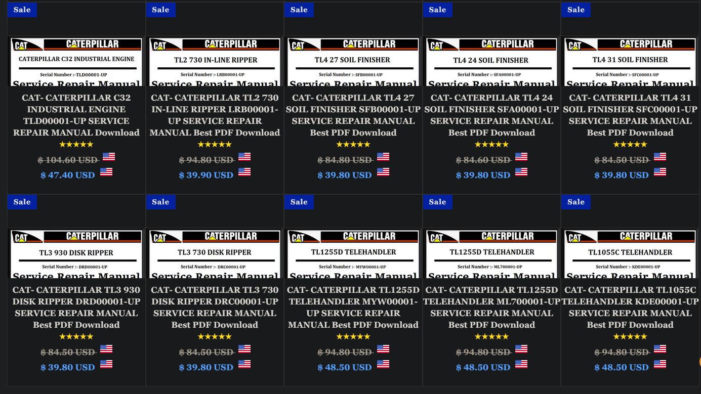

本当かどうか分からないが，確かに，TL2はIn-line ripper だし，TL3 はDisc ripperで，TL4 はfinisher だ．

調べてみると，TL5 はField cultivator だ．

[TL5 50のYoutube](https://www.youtube.com/watch?v=5bj7o0RmxXY)

インスタの，Big Tractor氏の発言が本当ならば，CAT カラーのTillage Equipment はTL2~TL5 それぞれの機械である可能がある．

ごく短い，僅かな期間で，CAT のTillage equipment が市場に出回ったのであれば，現在稼働している機械は大変に貴重なものであろう．

### TL2 Inline Ripper

まあ，普通のリッパーだろうと思ったら，Krause のリッパーが特殊みたいだ．
現在のKuhn-Krause のリッパーと形状が似ている(リンク)
Deere の2100 と比べると，全然違う．

#### 同じところ
- ヒッチはカテ3
- スタンダードはスプリングクッション，コールタもスプリングクッション
- フレームはツールバー方式，スタンダードもコールタも，全てUボルト
- 
#### 違うところ
- ゲージホイールが1段目のツールバーの真下，コールタと同じ位置

### TL3 Disk ripper

### TL4 Multi Finisher

### TL5 Field Cultivator
これだけ，まだカタログが見つかってない．
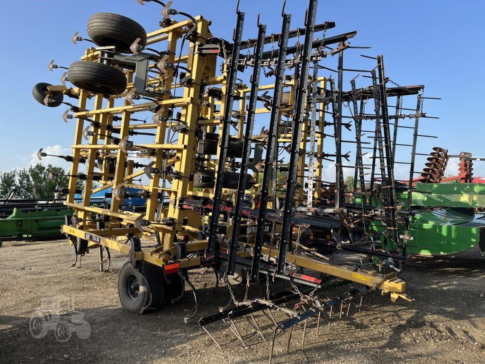

でも，動画はあるし，こういう写真はある．

## combine harvester 

Cat のコンバイン、中身はClaasのLexion. 
Lexion から始まったわけではなく、おそらく228CS時代からの流れ。
Claas がCat のtrack 技術が欲しく、Cat がClaas のコンバイン技術が欲しく、パートナーになったイメージだと思う。

### 116CS, 228CS Track
伝説の、試作コンバイン。
228CS Track は2019年くらいのagrithecnica でミニチュアが限定販売された。

[これは知らないカタログですねぇ](https://www.reddit.com/r/farmingsimulator/comments/xp0tki/claas_commander_116228_cs_mts_mod_idea/#lightbox)

228CSなど、Commandor シリーズの変態コンバインに、cat のMTSを装着した、さらなる変態コンバイン。

### [ドイツ語の動画](https://www.youtube.com/watch?v=tqZ6o5jGDiI&list=LL&index=6)
こは、カナダのサスカチュワン州南部にあるファミリーファームを訪れたときの様子です。ファームは州都レジャイナの南に位置し、ここからアメリカの国境までは車で約1時間の距離です。

この日の午後は、デュラム小麦、いわゆる硬質小麦の収穫作業が行われており、ファミリーが所有する4台のうち3台の黄色と黒のクラースレクシオン760テラトラックが活躍していました。

このコンバインは、アメリカ・ネブラスカ州オマハの工場で製造されており、型式はC75。搭載されているエンジンは、キャタピラーC13エンジンで、最大出力は536馬力です。

一方、ヨーロッパのレクシオン760コンバイン（型式C75）は、パーキンスエンジンが搭載されており、こちらも最大出力は約530馬力となっています。

これらのコンバインには、すべてMacDon FD75およびFD140のフレックスドレーパーヘッダーが装備されており、最大作業幅は12メートルを超えます。菜種の収穫時には、場合によってクラースのバリオ1200のヘッダーも使われることがあり、これは作物の密度が高く、理想的な状態の時に限られます。

北米の畑で見られる黄色のコンバインは、今ではかなり珍しくなりました。クラースは2019年にレクシオン6000、7000、8000シリーズの新型モデルを発表し、それ以降、機械をクラースの象徴である緑色で販売し始めました。

クラースのストーリーについては、下のビデオ説明欄にリンクを貼っておきますので、そちらからも詳しく確認できます。

クラースがアメリカ市場に参入したのは、50年以上前のことです。その始まりは「フォード」との協力関係からでした。1965年、クラースはアメリカの大手企業であるフォードと提携契約を結び、青と白に塗装されたコンバインをアメリカに輸出していました。

しかし、この契約は1980年代半ばに終了し、1989年、クラースは「マッセイ・ファーガソン（Massey Ferguson）」と新たに提携しました。このとき、コンバインの色は赤色に変更され、再び異なるブランド名で販売されました。

その後、青、赤に続いて「黄色」へと変わりました。1990年代、クラースはキャタピラー（Caterpillar）とジョイントベンチャーを設立しました。当時、キャタピラーは自社開発のラバートラックトラクターを持っていましたが、収穫機械は持っていませんでした。そこで、クラースとキャタピラーは「クラースが北米市場向けのコンバインを製造し、キャタピラーがクローラー型トラクターをヨーロッパに輸出する」という合意を結びました。

コンバインの製造のために、ネブラスカ州オマハに新しい工場が建設されました。

しかし、キャタピラーは2000年に農業機械の製造から撤退しましたが、レクシオンの黄色いカラーリングは2019年まで維持され、エンジンも引き続きキャタピラー製が搭載されていました。

ここでの収穫作業では、キャタピラーの「チャレンジャーMT865」クローラーがオーバーロードワゴンの牽引に使われています。カナダの畑ではこのマシンが今でも活躍しており、500馬力を誇るこの機械は、まさに「力持ち」と言えます。

使用されているオーバーロードワゴンは、カナダ・マニトバ州アルトナにある「Elmers」社製の「Haulmaster 1600」です。このオーバーロードワゴンの積載量は1600ブッシェル（約57立方メートル）です。

この日は、新しいオペレーターがキャタピラーのラバートラックに乗り込み、操作を学んでいました。そのため、少し慎重に運転している様子が見られました。

この映像は、2023年に私がカナダで撮影したもので、私にとって今でも思い出深い出来事の一つです。2024年にも再び撮影を計画していましたが、ファームと周辺の農場が、今年は激しい嵐と雹の被害を受けたため、残念ながら実現しませんでした。多くの農場が最大80%もの損失を被ったようです。

ここに書いてある通り、オマハ工場は昔からcat のページにもあり、現在はclaas の工場になっているようだ。

### [Claas の公式説明](https://www.claas.com/en-us/discover/stories/many-places-one-passion/omaha)

### 1999年のCATの魚拓にも、当時の工場開設の際の記事が出ているね。

### 日本では。

諫早湾の干拓地で、一台動いていると思われ。
[575R](https://youtu.be/WCoyebnijAk?si=voSBt1AtPv4XSGUO)
Ziegler のロゴがあるから、本当にこれはアメリカ製だと思われる。
5月下旬に諫早湾で作業している。

芽室に、cat カラーにlexion を塗っている人がいると聞いたことがあるけど、それはドイツだろう。

