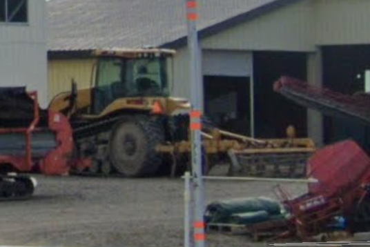
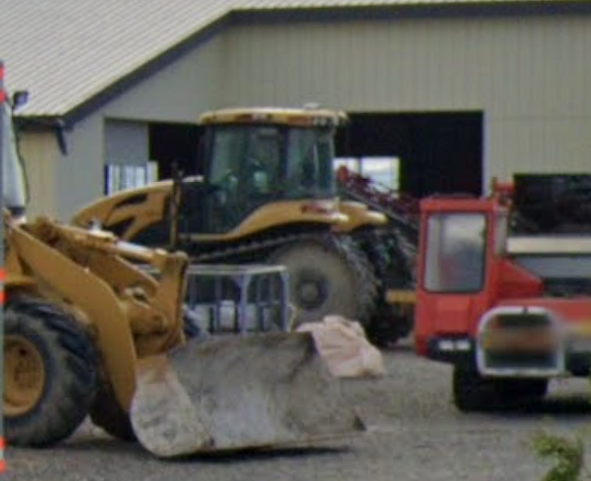

# 日本で見られるチャレンジャー: 合計 20台前後(2024年11月時点)

隠れチャレンジャーがあるとしたら...
公社が未知数すぎる．

- スガノ農機: 1台?
    上富良野の土の館に置いてある，かも．
    - [水戸市の方のブログ](https://oba-shima.mito-city.com/2016/03/31/caterpillar-challenger/)
    あと，ほ場整備で，創新さんがもってるかな．
    - [ほ場整備では活躍](https://www.sugano-soushin.co.jp/page/page000055.html)
    - [素晴らしいまとめ](https://www.sugano-soushin.co.jp/page/page000086.html)

- K農場(由仁): 3台
初代65から，ずっとある．
45は2台.
    - [あらら... ](https://twitter.com/kuroushi/status/887507545224392704)

- MGJ(苫前): 0台(1台)
おそらく，MT700A シリーズ
AGCO に移る前の，Dekalb 最後のトラクター，CATのチャレンジャー．Cat が持ってきたのかな．
    - [写ってそうなリンク先1](https://www.city.fukagawa.lg.jp/cms/section/osamunai/uo2pli0000015ikz-att/uo2pli0000019n3e.pdf)
    - [写ってそうなリンク先2](https://sun-green.co.jp/sys/wp-content/uploads/2019/12/72-01.pdf)
    - [MT700Aの色々な写真](https://www.proxibid.com/lotinformation/53772864/caterpillar-challenger-mt735-mt745-mt755-mt765-85e-mt900b-mt800c-mt900cb-brochures)
    - [700Bではないでしょう](https://www.kellytractor.com/eng/images/pdf/agriculture/rubbertired_tractors/mt700b_brochure.pdf)
    本別I農場に渡って、今(2024年現在)はktngnmにあるとかないとか: あるわ．
    
    
    
    

- 阿部建設(新篠津): 1台
    - [35](http://abekensetu.com/machine/machine_gallery/dsc00508/)

- HighBridge テレビ: 1台
高橋さんなのだろうか．道東の方のようだが，土建屋さんのものか，公社のものか．
    - [融雪剤散布の動画](https://www.youtube.com/watch?v=Y9tr940yfk4) 

- 公社: ?台, 全部，マテック
だいぶマテック行きになっているのもいるが，まとまった台数を購入したのは，公社．北見に多かった．
その昔，釧路かどこかの牧草地の斜面のプラウ耕作業で，D6のブルとチャレンジャーとを戦わせて見たとき，圧倒的にチャレンジャーが早く登って耕していったのを公社のおえらいさんが見て，導入を決めたとか．

- サンフレッシュ海津(岐阜): 1台
高木さん，チャレンジャーでプラウからキャベツ収穫まで
    - [プラウ](https://www.youtube.com/watch?v=AzmqBlvSuJM)
    - [キャベツ収穫](https://www.youtube.com/watch?v=oLu0TW718IU&t=18s)

- 森田工建(富良野): 4台
森田のご実家．35 が数台か．
    - [35](https://moritakouken.com/recruit/)
    - [プラウ](https://www.instagram.com/p/CuqHP7tyrIr/?img_index=1)

- 五稜建設(岩見沢): 2台
長沼とかでもよく見る会社．35が2台
    - [35](https://www.goryou-kensetsu.com/)

- 北伸建設(砂川): 1台
35が1台だけど，阿部建設さんと同じく，D6で2段耕する機械をもってる会社. 
すばらしい．
    - [35](https://www.hks.co.jp/business/machinery/list/)

- 西口商事(新篠津): 1台
西口さんも45を1台持ってるんだね．

- Sさん(小平？): 1台
確か2014年くらいには，45を所有していたはず．

# クローラ関連のリンク
[農業経営者のリンク](https://agri-biz.jp/item/content/pdf/8179)
