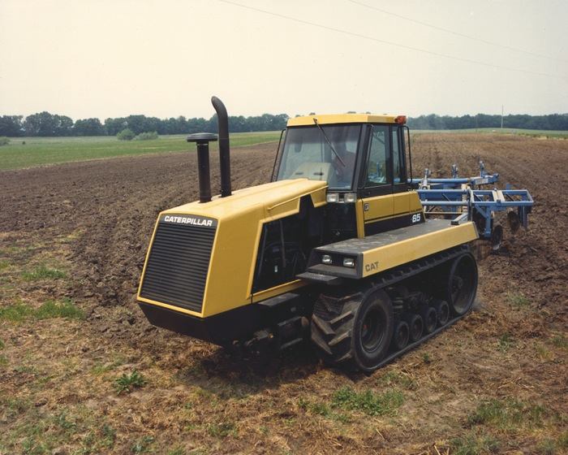
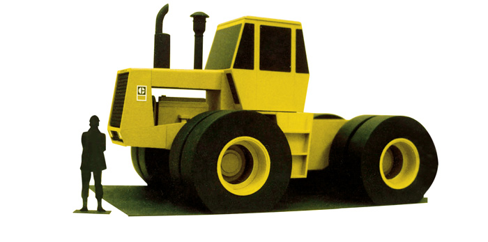
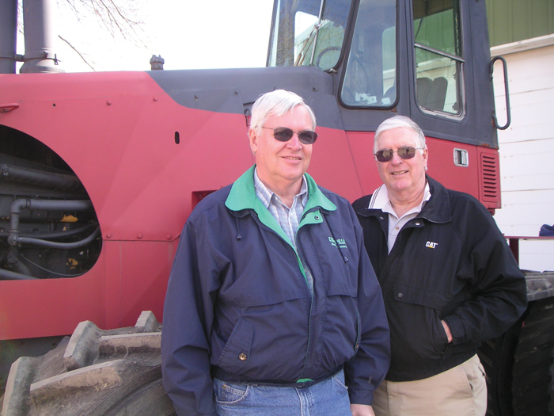
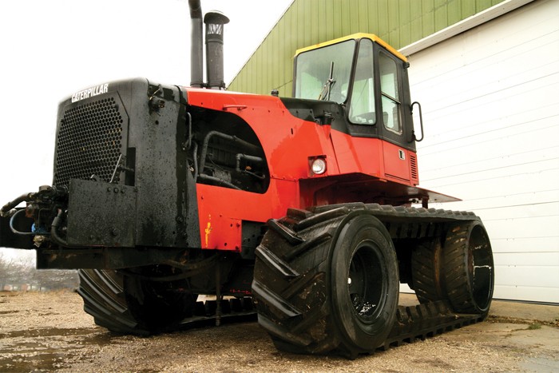
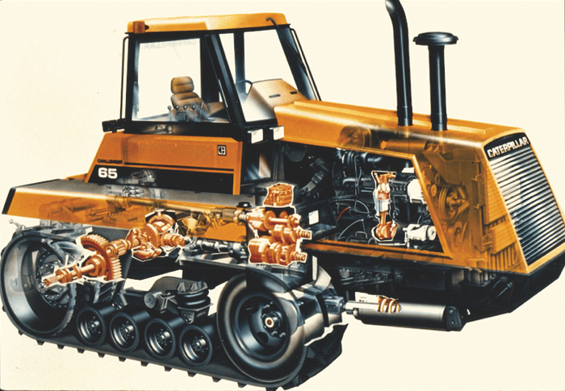
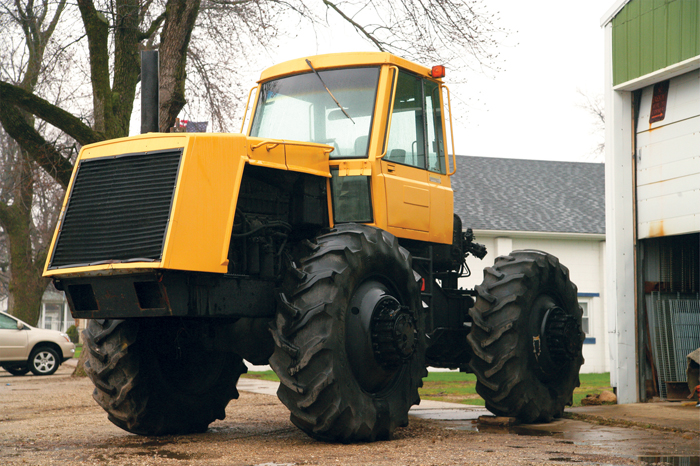
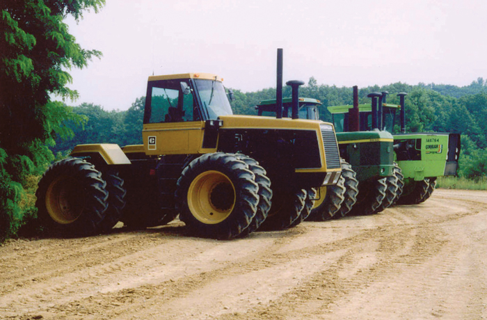
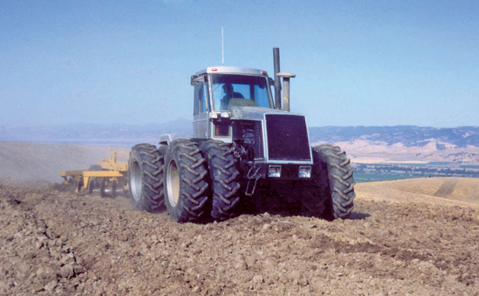

# How engineers developed the rubber-belted tractor: Scott Garvey

## Part One: In the late 1970s Caterpillar was looking for a way to break into the ag tractor market. It had two options.

This year even a casual stroll through a farm machinery show will reveal the obvious trend toward increased use of rubber-belted track systems. 
And manufacturers have recently introduced even more options for those who want the benefits that technology offers.

In less than three decades belts have gone from the fringe to the mainstream, so we at Grainews decided it was time to take a look back at how the technology was created. 
In 2007 I had a chance to talk to the two engineers who collaborated and developed the first belted tractor and hear from them how the process evolved.
In the mid 1970s Caterpillar had been selling farmers a relatively small number of steel tracked SA (Special Application) crawlers suited for field work, particularly in some regions of California.
But the SA crawlers were gradually losing market share to the increasing number of high-horsepower, four-wheel drive tractors pouring into the segment from all the major manufacturers.
With weakened demand for equipment in the construction sector, executives at Cat decided to develop their own four-wheel drive tractor to break into that lucrative market, which offered the potential to boost the company’s flagging sales numbers. 
In-house development soon began at Cat to create the wheeled ag tractor executives wanted.

“In 1978 I was sitting having lunch with three of my colleagues at Caterpillar’s Peoria Proving Grounds in Illinois, and we were lamenting how Cat was pursuing a ‘me too’ (wheeled tractor) design while our name and reputation were in building the best crawlers in the world,” says Dave Janzen a now-retired Cat engineer and a key force in the eventual development of the belted Challenger tractor. 
Janzen had been working on making the steel-tracked SA crawlers more attractive to farmers.
He believed it was essential to increase their notoriously slow working speeds.
To do that, he would need to stuff more power under the hoods.
An initial experiment with a modified D5SA fitted with a 225 horsepower engine proved it could be done. 
On seeing the results of Janzen’s work, management at Cat approved further development aimed at creating a high-horsepower crawler with a forward weight bias, which made it better suited for drawbar pulling.

## The project begins

In 1979 the project began in ernest. “Our calculations showed that if we fitted a six-cylinder Cat 3306 engine of 240 horsepower into a smaller, lighter D4, that would give us the 100 pounds per horsepower that we sought to match the wheeled tractors,” says Janzen.
Eventually, to evaluate Janzen’s R&D progress and make a decision on the future of the ag crawler project, managers at Cat wanted to see for themselves what the D4 on steroids was really capable of.
So another field demonstration was arranged.

The company’s executive vice president and his staff came out to see the D4 be pitted in a head-to-head competition with a much larger, 350 horsepower, four-wheel drive tractor.
Both machines were hitched to identical nine-bottom ploughs.
As they set off side-by-side down the length of a half-mile field, the executives followed along watching while they sat on a row of hay bales on a wagon pulled by a Farmall M tractor.

Even with a pretty significant 110 horsepower advantage, the bigger wheeled tractor couldn’t outrun its smaller, tracked rival.

The executives were suitably impressed, and they decided to continue funding the ag crawler development.
Janzen had proven that the crawler no longer needed to be slow, and moving the chassis forward in relation to the tracks improved its ability to pull. 
But there were still problems to overcome.

The experimental tractor still used the standard clutch and brake or “jerk” steering common to crawlers of the day, which meant power only flowed to one track during turns.
And there was still the mobility restriction due to the steel tracks.
Most rural roads around the Proving Ground in Illinois were paved, so the D4 couldn’t travel on them.
Wheeled tractors still offered farmers a big advantage when it came to moving from field to field.

But there were potential solutions to those drawbacks, and they were within Cat’s grasp. 
In the 1960s Cat created its own rubber products division to manufacture steel reinforced hydraulic hose, which had a design created by one of its own engineers.
The hose was for use in the manufacture of construction machines.
One of the other products that division eventually created was the beadless tire for large off-road machines, which had a removable tire tread. 
It allowed equipment owners to just replace the tread rather than a whole tire.
Even though Cat sold its rubber products division to Goodyear a few years later, it still retained the capability to continue making some rubber products, including the removable tread for the beadless tire.

At the same time Janzen was working on the ag crawler project, company executives had also decided to have another engineer, Ron Satzler, look at potential uses for the removable tire tread, which was about the same size as a steel track.

However, there was still Cat’s own articulated ag tractor project, which was much further advanced than Janzen’s ag crawler concept that was still running on steel tracks.
Given the very difficult financial position Cat found itself in at the time, only one ag tractor project was likely to get funding through to completion.

## Part two: We finish the story by revealing how two research engineers at Caterpillar teamed up to merge ag crawlers with rubber belts

In the late 1970s, Caterpillar had been selling a limited number of SA (Special Application) crawlers to farmers. 
But the high-horsepower, articulated, four-wheel drive ag tractors that were pouring onto the market were eating into demand for those machines.
For that and other reasons Caterpillar executives eventually decided to develop and market their own four-wheel drive ag tractor.

At the same time R&D work progressed on the Cat wheeled ag tractor program, Dave Janzen, an engineer working at the company’s Peoria Proving Ground in Illinois, was redesigning the SA crawlers to make them more appealing to farmers. 
At the Proving Ground he modified a D4SA specifically for ag applications, and greatly improved its field performance.

Janzen put the prototype D4SA on a diet and it now weighed roughly 100 pounds per engine horsepower, giving it a power to weight ratio similar to ag tractors. 
That significantly increased its working speeds compared to other crawlers.
And moving the chassis forward relative to the tracks gave it a forward weight bias that improved its ability to pull.

But the D4SA still suffered from the limitations of steel tracks and having the same “jerk” steering system common to most crawlers of the day.
Those were big drawbacks compared to what dedicated ag tractors offered.

## Removable tread

As Janzen continued working on his D4SA, Ron Satzler, another Cat engineer working at the same Peoria Proving Ground, happened to be experimenting with alternative uses for the removable, cable-reinforced rubber tread for beadless tires the company’s Rubber Products Division had developed.
The tread was about the same size as a steel crawler track. Seeing the similarities wasn’t difficult.

Satzler had been using a modified road grader as a test bed to evaluate the performance and durability of the rubber tread when used as a track.
The tread-come-track had proven its durability in that application after a host of tests and evaluations.
So Satzler and his team knew they were onto something.
And while the rubber belts did not get approval for use on the construction equipment being produced at the time, Janzen’s D4SA ag tractor seemed an ideal use for it.

“I think it was the two teams that got together and proposed putting the rubber team’s track on the ag team’s D4SA,” said Janzen. 
“It was obvious to everyone that the rubber track should be installed on the D4SA. That resulted in the creation of the red D4 BAT (BAT stood for Belted Ag Tractor) as it was known, which was ready for testing in 1980.”

After being fitted with rubber tracks, Janzen’s original D4SA was taken to a local farm for field trials.
The farm owner used Versatile tractors. 
So the belted prototype was painted the same colours as a Versatile four-wheel drive tractor, in case anyone saw it working in the distance they would hopefully mistake it for one of the farmer’s Versatiles. 
That earned the prototype the name red D4 BAT.

Satzler and Janzen were now working together full time on the belted ag tractor’s development.

## Higher working speeds

To give it a wider range of working speeds, a 13-speed truck transmission was installed in the red D4 BAT. 
But those higher working speeds exaggerated the steering problem and showed a need for track suspension. 
To eliminate the steering problem, Satzler modified a differential steering system that was in limited use on other Cat crawlers at the time.
Using that updated system gave the ag tractor stable steering characteristics at the much higher working and road speeds; and it kept power flowing to both tracks, even during turns.
Satzler’s design remains the basis for steering systems on the Challengers to this day.

After being fitted with all the design updates, the red D4 BAT had now overcome the limitations that hampered Janzen’s original steel-tracked prototype, and it now showed a lot of promise.
But as the project progressed, Cat found itself in a difficult financial position; it was bleeding red ink. 
Money for R&D was scarce and executives no longer wanted to fund both the wheeled tractor and belted tractor development programs.

Even though the wheeled tractor was virtually ready for production, executives cancelled it in favour of the belted tractor after evaluating its potential, much to the shock of many engineers that had been working on the wheeled tractor.

Cat’s industrial design department had developed a body style for the wheeled tractor that was transferred to the first production version of the belted tractor, the Challenger 65. 
The designer who created the Challenger’s body style had previously worked for General Motors and brought some automotive styling cues to the tractor’s design, including the raked-back windshield.
Many ag tractors of the day used an opposite slope on windshields.

Initially, senior management considered keeping a steel-tracked version as an economy alternative to the rubber-belted tractor. 
The steel-tracked AG6 with Challenger body styling was built in small numbers but was soon discontinued.

Shortly before the 1987 market launch of the Challenger 65, the company had settled on using the Challenger name.
But the space shuttle Challenger disaster occurred shortly before the tractor was to be released, and executives worried that using the same name might be a marketing problem.
But they decided to stick with it, and most prospective customers didn’t seem to mind or notice.

In 2001 Caterpillar management decided ag tractors were no longer a good fit for the company and the Challenger tractor brand was sold to AGCO. 
The original red D4 BAT and the remaining wheeled prototype tractor were donated to Iowa State University when ownership of the brand changed.

However, both original prototypes are now in the hands of a private collector, although neither tractor is entirely complete, having had parts pirated at various times during ongoing development projects at the Proving Grounds. 
But they were saved from the scrap yard and remain symbols of an important milestone in ag machinery technology.

# 日本語

# ゴムベルト式トラクターが誕生した経緯：スコット・ガーヴィー

## 第1部: 1970年代後半、キャタピラーは農業用トラクタ市場への進出を目指して2つの選択肢を検討していた。

今日、農業機械展示会を何気なく歩くだけでも、ゴムベルト式のトラックシステムの使用が増加していることは明白です。  
そして、メーカーはこの技術がもたらす利点を求める人々に、さらなる選択肢を最近提供し始めています。

わずか30年足らずで、ゴムベルトは周縁的な存在から主流へと変貌しました。そのため、**Grainews**誌では、この技術がどのようにして生まれたのかを振り返ることにしました。  
2007年、筆者はこの技術を共同開発した2人のエンジニアに話を聞き、どのようにしてそのプロセスが進化していったのかを知る機会がありました。

1970年代半ば、キャタピラーは主にカリフォルニアの一部地域でフィールド作業に適した少量の鋼鉄製トラック式SA（特殊用途）クローラーを農家に販売していました。  
しかし、主要メーカー各社が市場に投入する高馬力の四輪駆動トラクタの台頭により、SAクローラーの市場シェアは徐々に低下していました。  
さらに建設業界の需要が低迷していたため、キャタピラーの経営陣は四輪駆動トラクタを開発し、この収益性の高い市場に進出することを決定しました。  
こうして社内で四輪駆動の農業用トラクタの開発が始まりました。

「1978年、イリノイ州のピオリア試験場で同僚3人と昼食をとりながら、キャタピラーが“後追い”の四輪駆動トラクタ設計を追求していることを嘆いていました。  
当社の名声は、世界最高のクローラーを作ることにあるのに、と」と、現在は退職したキャタピラーのエンジニア、デイブ・ヤンゼンは語ります。  
ヤンゼンは、鋼鉄製のSAクローラーを農業従事者にとってより魅力的なものにする作業に取り組んでいました。  
彼は、作業速度が遅いというクローラーの弱点を克服することが重要だと考えていました。そのためには、フードの下により多くのパワーを詰め込む必要がありました。  
ヤンゼンが225馬力のエンジンを搭載した改造型D5SAで最初の実験を行った結果、それが可能であることが証明されました。  
この成果を見た経営陣は、高馬力のクローラー開発をさらに進めることを承認しました。このクローラーは、トラックに対して前方に重量が偏る設計となり、牽引性能が向上しました。

---

## プロジェクトの開始

1979年、このプロジェクトは本格的に始まりました。  
「計算の結果、240馬力のキャタピラー3306型6気筒エンジンをより小型軽量なD4に搭載すれば、四輪駆動トラクタに匹敵する馬力100ポンド（重量比）を達成できるとわかりました」とヤンゼンは言います。  
その後、ヤンゼンの研究開発の進捗を評価し、農業用クローラープロジェクトの将来を判断するために、キャタピラーの幹部が実際にD4の能力を目の当たりにすることになりました。  
そのため、もう一度フィールドデモが行われました。

会社の副社長とスタッフが、D4と350馬力の四輪駆動トラクタを直接対決させる様子を見に来ました。  
両機は同じ9連プラウに連結され、半マイル（約800m）の畑の長さを横に並んで進みました。  
幹部たちは、Farmall Mトラクタに引かれた干し草のベールを積んだワゴンに座ってその様子を追いました。

110馬力の差があったにもかかわらず、大型の四輪駆動トラクタは小型のクローラーを引き離すことができませんでした。

幹部たちは十分に感銘を受け、農業用クローラーの開発資金を継続することを決定しました。  
ヤンゼンは、クローラーがもはや遅い必要がないことを証明し、トラックに対してシャシーを前方に移動させることで牽引力が向上することを示しました。  
しかし、まだ克服すべき課題が残っていました。

試作トラクタは、当時のクローラーに共通する「ジャーク」操作（クラッチとブレーキを用いた操縦）を採用しており、旋回時には片側のトラックにしか動力が伝わりませんでした。  
また、鋼鉄製のトラックを使用していたため、移動性にも制約がありました。試験場周辺の田舎道は舗装されていたため、D4はその上を走行することができませんでした。  
四輪駆動トラクタは、畑から畑への移動において、依然として大きな利点を持っていました。

しかし、これらの欠点を解決する可能性はキャタピラーの手の届く範囲にありました。  
1960年代にキャタピラーは独自のゴム製品部門を設立し、自社のエンジニアが設計した鋼鉄補強付き油圧ホースを製造しました。このホースは建設機械の製造に使用されました。  
その後、この部門は大型オフロード機械用のビードレスタイヤ（交換可能なトレッド付き）も開発しました。  
その後キャタピラーはゴム製品部門をグッドイヤーに売却しましたが、一部のゴム製品（ビードレスタイヤの交換可能なトレッドを含む）を製造する能力は保持していました。

ヤンゼンが農業用クローラープロジェクトに取り組んでいる間、会社の幹部はもう一人のエンジニア、ロン・サッツラーにも、この交換可能なトレッドの潜在的な用途を検討させていました。このトレッドは鋼鉄トラックとほぼ同じ大きさでした。

---

## 第2部: 2人のキャタピラー研究エンジニアが農業用クローラーとゴムベルトを融合させるまで

（続きます）

（続き）

1970年代後半、キャタピラーは少量のSA（特殊用途）クローラーを農家に販売していました。  
しかし、市場に投入される高馬力の関節式四輪駆動農業用トラクタがそれらの需要を侵食していました。  
そのため、キャタピラーの経営陣は最終的に独自の四輪駆動農業用トラクタを開発・販売することを決定しました。

その一方で、ピオリア試験場で四輪駆動トラクタの開発が進められている間、エンジニアのデイブ・ヤンゼンは、SAクローラーを農家にとってより魅力的なものにするための再設計を行っていました。  
試験場では、彼はD4SAを農業用に改造し、その性能を大幅に向上させました。

ヤンゼンは、試作機D4SAの重量を削減し、エンジン馬力100ポンドに対する重量比を農業用トラクタと同等の値にしました。  
その結果、従来のクローラーよりも作業速度が大幅に向上しました。また、トラックに対してシャシーを前方に移動させたことで、牽引性能が向上しました。

しかし、D4SAは依然として鋼鉄製トラックの制約を受けており、当時のクローラーに共通する「ジャーク」操作の問題も抱えていました。  
これらの欠点は、専用の農業用トラクタと比較すると大きな障害でした。

---

### 交換可能なトレッド

ヤンゼンがD4SAの改良を進めている間、同じピオリア試験場で働いていたもう一人のキャタピラーエンジニア、ロン・サッツラーが、交換可能なケーブル補強付きゴムトレッドの新しい用途を模索していました。このトレッドは、ビードレスタイヤ用にキャタピラーのゴム製品部門が開発したもので、鋼鉄製トラックとほぼ同じ大きさでした。

サッツラーは、改造したロードグレーダーを試験装置として使用し、ゴムトレッドをトラックとして使用した場合の性能と耐久性を評価していました。このトレッドがその用途に耐えうることは、一連の試験と評価を通じて証明されました。  
その結果、サッツラーとそのチームは、新たな可能性に気づきました。建設機械には採用されなかったものの、ヤンゼンのD4SA農業用トラクタには理想的な用途だと考えられました。

「ゴムチームのトラックを農業チームのD4SAに取り付けるべきだという提案がなされたのは、両チームが協力した結果だったと思います」とヤンゼンは言います。  
「ゴムトラックをD4SAに取り付けるのは明らかでした。その結果、『赤いD4 BAT』（BATはBelted Ag Tractorの略）と呼ばれるものが1980年に完成し、試験の準備が整いました。」

ゴムトラックを装着したヤンゼンのD4SAは、地元の農場でのフィールド試験に持ち込まれました。その農場の所有者はVersatile社製トラクタを使用していました。  
そのため、ゴムトラックを装着した試作機は、遠くから見た人が農場所有者のVersatileトラクタと勘違いすることを期待して、Versatileの四輪駆動トラクタと同じ色に塗装されました。  
このことから試作機は「赤いD4 BAT」と呼ばれるようになりました。

ここから、サッツラーとヤンゼンはフルタイムでゴムベルト式農業用トラクタの開発に取り組むことになりました。

---

### 作業速度の向上

「赤いD4 BAT」の作業速度の幅を広げるために、13速トラック用トランスミッションが搭載されました。  
しかし、その高速作業により操縦問題が強調され、トラックのサスペンションが必要であることが明らかになりました。  
そこでサッツラーは、当時キャタピラーの他のクローラーで限定的に使用されていた差動操縦システムを改良しました。この改良により、農業用トラクタは高速作業時および道路走行時にも安定した操縦特性を得ることができました。  
さらに、このシステムは旋回時にも両トラックに動力を供給し続けることができました。サッツラーの設計は、現在のチャレンジャートラクタの操縦システムの基礎となっています。

設計の更新をすべて施した後、「赤いD4 BAT」はヤンゼンの最初の鋼鉄製トラックの試作機が抱えていた制約を克服し、大きな可能性を示しました。

---

### 最初のチャレンジャー誕生

プロジェクトが進む中、キャタピラーは財務的に困難な状況に陥っていました。  
R&Dに充てる資金は不足しており、四輪駆動トラクタとゴムベルト式トラクタの開発プログラムを同時に継続することはもはや不可能でした。

実用化目前であった四輪駆動トラクタは、ゴムベルト式トラクタの可能性を評価した経営陣によって開発中止となり、多くのエンジニアに衝撃を与えました。

1987年、市場投入が予定されていたチャレンジャー65の名前は、スペースシャトル「チャレンジャー」の事故が発生した直後であったため、一部で懸念がありましたが、最終的に変更されることはありませんでした。

2001年、キャタピラーは農業用トラクタ事業が不適合であると判断し、チャレンジャーブランドをAGCOに売却しました。  
現在、最初の試作機である「赤いD4 BAT」は民間コレクターの手に渡っていますが、一部の部品は他のプロジェクトで使用されたため完全な状態ではありません。それでも、この機械は農業機械技術における重要なマイルストーンを象徴する存在として保存されています。

