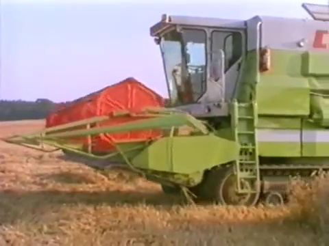

# 116cs切り抜き

素晴らしい．

   
   
   
  
  
  

  
  
  
 
 
 

# セリフ

## German
Zur langfristigen Erhaltung der Bodenfruchtbarkeit hat CLAAS in Zusammenarbeit mit Caterpillar ein ingenieurtechnisches Projekt durchgeführt. Dabei wurde das TerraTrac-Laufwerk entwickelt – ein bodenschonendes, schnelllaufendes und straßentaugliches Raupenlaufwerk für Mähdrescher und Transportfahrzeuge.

Das TerraTrac-System reduziert den Bodendruck erheblich im Vergleich zu herkömmlichen Reifen oder Stahlraupen. Während ein Reifen 2,1 kp/cm² Druck erzeugt, sind es beim TerraTrac-Laufwerk nur 0,4 kp/cm² – ähnlich dem Druck, den ein Mensch beim Gehen ausübt.

Ein elastisches 4,5 Quadratmeter großes Powerband trägt die Maschine. Druckrollen verteilen das Gewicht gleichmäßig über die große Aufstandsfläche. Die Bandspannung wird über einen hydraulisch-pneumatischen Zylinder geregelt. Der Antrieb erfolgt verschleißfrei über Ölmotoren und innenliegende Führungsnocken. Wendemanöver auf engem Raum sind durch unterschiedliche Drehzahlen der Laufwerke möglich.

Das Laufwerk ist pendelnd aufgehängt, was Bodenunebenheiten ausgleicht und Laufruhe fördert. Die Steuerung erfolgt wie bei einem Radfahrzeug mit Lenkrad und hydrostatischem Fahrhebel. Zwei Druckregler in der Lenksäule steuern die Ölpumpen.

Eine umfassende Bodenschonung ist nur mit einem abgestimmten Gesamtsystem möglich. Daher sind auch die Transportfahrzeuge mit TerraTrac-Technik ausgestattet. Ein 18 m³ großer Transportwagen nutzt dieselbe Laufwerkstechnologie, ist vielseitig einsetzbar und wartungsarm.

CLAAS TerraTrac steht für innovative Raupentechnik mit hoher Lebensdauer, Mobilität auf Feld und Straße sowie einem Beitrag zur nachhaltigen Landwirtschaft.

## English 
To ensure the long-term preservation of soil fertility, CLAAS, in collaboration with Caterpillar, carried out an engineering project that led to the development of the TerraTrac system – a soil-friendly, high-speed, road-capable crawler track system for combine harvesters and transport vehicles.

The TerraTrac system significantly reduces ground pressure compared to traditional tires or steel tracks. While a tire exerts 2.1 kp/cm², TerraTrac produces only 0.4 kp/cm² – similar to the pressure a person exerts while walking.

An elastic power band covering 4.5 square meters supports the machine. Pressure rollers distribute the weight evenly across the large contact area. A hydraulic-pneumatic cylinder adjusts the tension of the power band. The drive operates without wear via oil motors and internal guiding lugs. Turning in tight spaces is enabled by varying the speed of each track independently.

The track system is mounted on a pendulum suspension, compensating for uneven terrain and ensuring smooth operation. The machine is steered with a standard steering wheel and a hydrostatic drive lever. Two pressure regulators in the steering column control the oil pumps that power the drive motors.

True soil protection requires a complete, coordinated harvesting system. Therefore, transport vehicles are also equipped with TerraTrac technology. An 18 m³ transport trailer uses the same system, is versatile, and requires little maintenance.

CLAAS TerraTrac stands for innovative crawler technology with long service life, mobility both in the field and on roads, and a contribution to sustainable agriculture.

## Japanese

土壌の肥沃度を長期的に維持するために、CLAASはCaterpillarと共同で工学プロジェクトを実施し、TerraTrac（テラトラック）システムを開発しました。これは、コンバインや運搬車両向けに設計された、土壌に優しく、高速で道路走行も可能なクローラ式走行装置です。

TerraTracは、従来のタイヤやスチール製のクローラと比べて、地面への圧力を大幅に軽減します。タイヤは2.1 kp/cm²の圧力をかけるのに対し、TerraTracはわずか0.4 kp/cm²で、人が歩くときの圧力に近い数値です。

4.5平方メートルの弾力性のあるパワーバンドが車体を支え、圧力ローラーが重量を広い接地面全体に均等に分散させます。パワーバンドの張力は油圧・空圧シリンダーで常に調整されます。内部のガイドノックを使ったオイルモーター駆動で、摩耗のない伝達が可能です。左右の走行装置の速度差を活かして、狭い場所でもスムーズに旋回ができます。

この走行装置は、振り子のように可動する懸架構造で地面の凹凸に追従し、走行安定性を高めます。操作は通常の車と同様にステアリングホイールと油圧レバーで行います。ステアリングコラム内の2つの圧力レギュレーターが、オイルポンプを制御し走行モーターに動力を供給します。

真に土壌に優しい収穫作業には、システム全体の整合性が必要です。そのため、運搬車両にもTerraTrac技術が採用されています。18立方メートル積載可能な運搬車両にも同様の技術が使われ、農業のさまざまな運搬作業に対応でき、メンテナンス性も高いです。

CLAASのTerraTracは、耐久性に優れ、畑と道路の両方で機動性を発揮する革新的なクローラ技術であり、持続可能な農業への貢献を目指しています。
