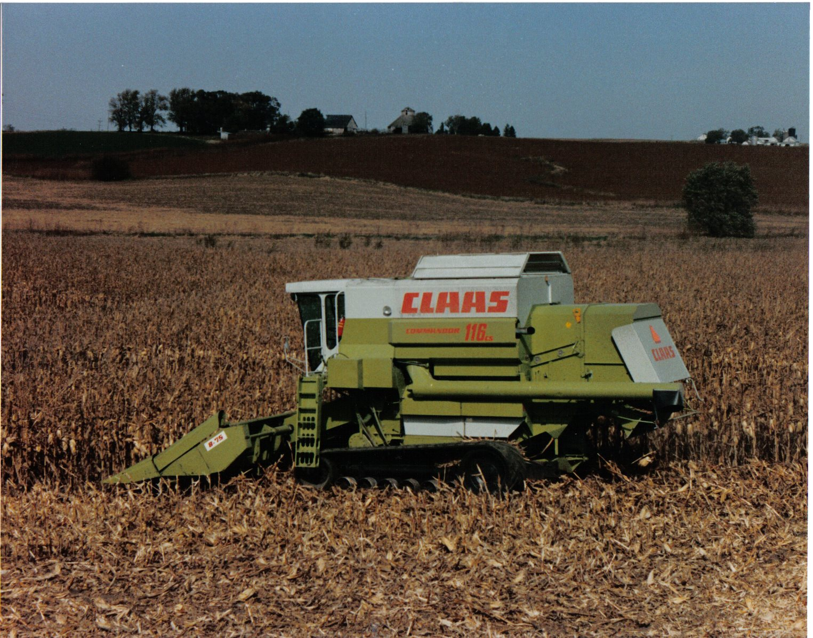

# Claas 

## Commandor 114/116/228 CS Mobile track system

- [PR動画!?](https://www.youtube.com/watch?v=oOO7BQskOfk)
- [当時の貴重な動画1](https://www.youtube.com/watch?v=bvHTqTpl90g)
- [当時の貴重な動画2](https://www.youtube.com/watch?v=J-DffV_MWQg)
- [Profi の動画](https://www.youtube.com/watch?v=W6my_Iv7Lok)
- [reddit ](https://www.reddit.com/r/farmingsimulator/comments/xp0tki/claas_commander_116228_cs_mts_mod_idea/)
- [yesterday combine](https://forums.yesterdaystractors.com/threads/claas-228-combine-track-machine.1764183/)
- [そもそも，commandor が変なコンバイン](https://www.youtube.com/watch?v=O46blmJ3XRU)

claas とcaterpillar の，技術トレードの結果生まれた摩訶不思議なコンバイン

[PR動画の要約と切り抜き](./116cs.md).

## Terra Trac の歴史
[動画](https://www.youtube.com/watch?v=w7uEi3Siwt0)

[公式ページ](https://www.claas.tw/products/technologies/terra-trac/expertise)

## [cat との関わり](../cat/README.md)がある
