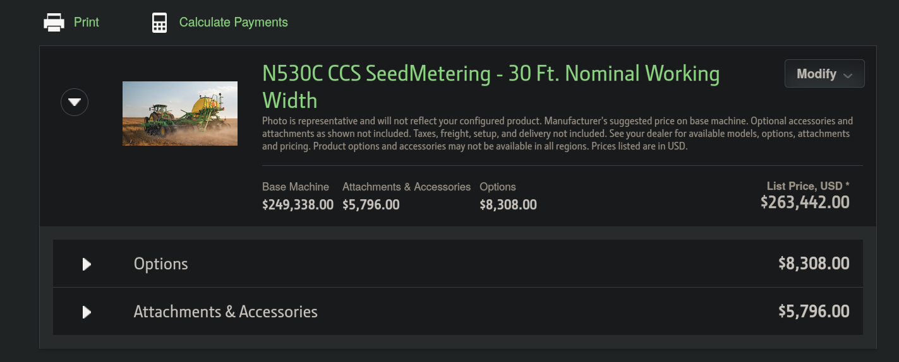

# John Deere
Nothing Runs Like a Deere

[日本のジョンディアについてはこちら](jpDeere.md)

地域によって生産・販売している品目が異なる．
トラクタは大筋同一であるが，コンバインは小型サイズのものが様々であったり，耕起やドリル関連はほとんど機械の種類が異なる．

主要なところ->

- [US John deere](https://www.deere.com/en/)
- [UK John deere](https://www.deere.co.uk/en/)
- [BR John deere](https://www.deere.com.br/pt/)
- [Africa John deere](https://www.deere.africa/en/index.html)
- [CN John deere](https://www.deere.com.cn/zh/index.html)

## Tractor
### Power beyond は何．

[Pressure free return and power beyond](https://salesmanual.deere.com/sales/salesmanual/en_GB/tractors/2017/feature/hydraulics/6m/power_beyond_r2_t4.html)

- Pressure free return

Pressure-free return is now available optionally ex-factory. The option comes with two couplers, the larger 19-mm (3/4-in.) pressure-free return port for large oil quantities (black cover) and a smaller (yellow cover) pressure-free return for motor case drain.
    - Direct oil flow return to the oil tank
    - Mounted flat-face couplers for less leakage
    - 19mm coupler allows for large, unrestriceted oil volumes
    - Allows pressure-free return of oil via two ports: tank return and drain
    - Pressure is generated via SCV

- Power beyond 

Power beyond allows the supply of hydraulic oil to implements with own control valves (for example, electrohydraulic valves on trailed silage wagons and balers) or hydraulic motors (for example, a vacuum fan on a planter or a pump on a sprayer).
It is a dedicated plate located on the right-hand side of the rockshaft providing four ports: pressure, load sensing (LS), pressure-free return, and motor case drain.
Use power beyond when:
    - Implement has its own control valve governing the amount of oil required via load sensing.
    - No other SCV outlet is available.

Benefits and details
    - Reduction of wear due to a high level of efficient use of hydraulic oil circulation.
    - Better system performance as only the required amount of oil is provided to the implement.  
    - Four separate parts are provided at the rear end of the tractor: pressure (P), load sensing (LS), tank return (R), and drain (D).
    - All couplers are flat-face couplers.

外部作業機のロードセンシングを行うために，SCVのモータの流量を調節するための回路を構成するためのバルブがPower beyond.
トラクタのパワーステアリングやヒッチの上下，トランスミッションなどにはロードセンシングしながらのクローズドセンタで油圧回路を構成している.
外部作業機側にも差圧を取るバルブがついていて作業機が負荷に応じてトラクタ側の油圧流量の制御を求める場合，，差圧をモータに入力するための油圧回路が必要になるためpower beyond が必要．

## Combine

## Splayer
### 北米ジョンディアとヨーロッパジョンディアの違い 

北米では自走式しか販売していないが，ヨーロッパは牽引式と自走の両方を販売している．
自走は全く異なるスタイルで販売されている．

|ポイント |  北米  |  ヨーロッパ  |
|---- | ---- | ---- |
|足回り|  Dumper  |  XTRAFLAX  |

[410Rの足回り](https://partscatalog.deere.com/jdrc/sidebyside/equipment/36980178/referrer/navigation/pgId/893723735)

[R4150iの足回りi](https://partscatalog.deere.com/jdrc/sidebyside/equipment/4472577/referrer/navigation/pgId/854503071)

## Drill
A seed driill used to plant small seeds like wheat or rice in rows, with rows closely spaced about 4-7.5 inches.
On the other hand, a planter used to plant large seeds like corn or soy bean in rows, with rows closey spaced about 20-40 inches.

deere のドリルのほとんどはコモディティカート引っ張ってドリルユニットで播種する形式ばかり．
長くなるけどそのほうが合理的であるのに間違いない．
が，日本では道路移動不可能なサイズの場合がほとんどだし狭いほ場での取り回しはそれほど得意ではなさそう．

### Box Drills
[Online](https://www.deere.com/assets/publications/index.html?id=f1e99c2a#11)
or

- 1590はどうか．

いかんせん構造上折りたたみは厳しいため，作業幅を拡げるには1590の20'になるかもしれない．そうすると道路移動が厳しくなる．
公式のカタログに書かれているけれども，1590でちょうどよくて，もう少し幅の広い，効率的な作業機械をお求めの場合は1990CCS drill のようなものがよいと勧められている．

1590のrow-spacing は7.5" か10" のどちらか．

- 455 のようなドリルはどうか．

幅を稼ぐ意味では，455 のようなtri-folding drills でもよさそう．

455であればrows spacing は6" サイズのものがある．

これは，1590のようなno-tillユニットとは形状が異なるため．

キャパシティは455は1590よりもボックスサイズが若干小さくなる．
1520の15' モデルとほとんど同じである2.8bu/ft

- 1520 は微妙．

ハンドリングは良さそう．
455とユニットは共通みたい．

- BD11 は異なる用途．
CRP ground のような狭い土地での播種に向いている．

### Centrail Comodity System(CCS) No-till Air Drill

[Online](https://www.deere.com/assets/publications/index.html?id=ec2fcd6f)
or 
[PDF](./brochure/airSeeding_2021.pdf)

- N500C series

1590が好きな人はもう少し幅の広い1990CCSなんてよいのでは，というカタログに書かれていたやつ．
1990 CCSは使いにくくて酷評されている... 

2023年現在では1990CCSは名前を変えてN500cシリーズに名前を変えている．

- マイナーチェンジなのだろうけど，ブロワーの位置，タンク形状と位置を見直してmetering へのアクセスを改善している．
- タンクサイズは大型化．
- とにかく掃除しやすく使いやすい．

トラクタと通信して色々やり取りしているから，これは新しいトラクタが必須かもしれない．
rows spacing は1590と同じ7.5, 10, 15の展開．
作業幅は30, 36, 40, 42 feet の展開．

新しいトラクタ(7Rとか8RXとか)があればトラクタと通信して様々な機能が使えそう．
通信規格はISOBUS？オリジナル?

- SectionCommand 
種子や肥料のセクションコントロール．
電動モータで精密に制御しているから，ドリルに電源を供給する必要がある．
いくつか方法があり，DC/DCコンバータ，PTO発電，オンボード油圧モータ発電機の中から選ぶことができる．
    - 一番のおすすめはDCDC コンバータ，
    ISOBUSピンを使って56Vをトラクタから供給するため改造が少なく，取り外しも容易．
    - オンボード油圧モータ発電機
    はパワービヨンドを使う．
    - PTO発電機はトラクタの油圧容量に関係なく電源の供給が可能． 

- ActiveCal
メータリングユニットのキャリブレーション機能
- RelativeFlow
流量センサ．
それぞれのユニット毎に調整することができるから精密な播種が可能．

- TruSet Technology
seeding unit の押し付け圧の調整

[Western Equipment によるキャリブレーション](https://www.youtube.com/watch?v=66kAejNnWmY)

これはトラクタとセットじゃないと扱いこなすのが厳しいかも．

そしておそらく，とんでもなく高価... 25万ドル！！！！！！！４０００万！！！

### 1590 に代わるドリルはなんだろうか．

要件
- 日本の狭い道路でも移動できる移動幅
- N530C  

## Tillage

