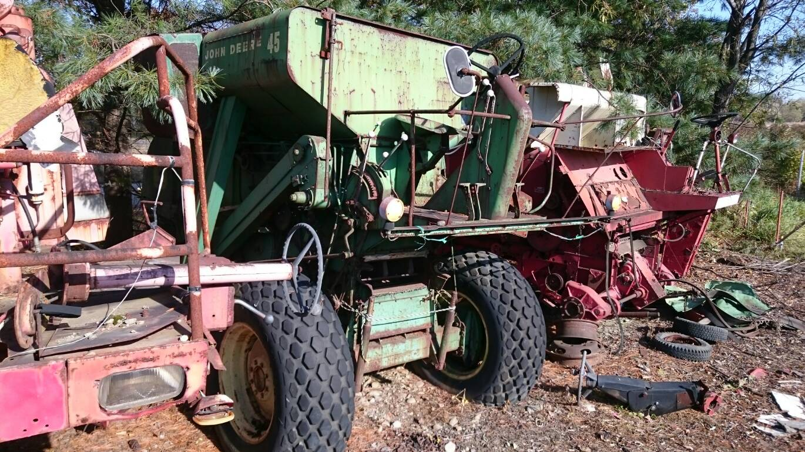

# 日本のジョンディアトラクタについて

日本におけるジョンディアトラクタの歴史について，

おそらく最初はキープ牧場にキープ牧師が直輸入したModel D だと思われる．
そのあと，Model A, B 430 等が輸入される．

一方，三国商工は1010などのアメリカトラクタや，マンハイムの1020等を持ってくる．

それから日立建機がジョンディアと技術提携を結んだことにより，数年，日立ージョンディアが販売される．
その後，1977年からヤンマーが販売を引き継ぎ，現在に至る．

## マニュアスプレッダーはタカキタ製? 

もともとはカナダの会社で作っていたが、それがなくなったので日本のタカキタに図面を渡して作ってもらっていたらしい。
情報のソースがほとんどない。

# 某所の45
初めて日本に入ってきた、ジョンディアの自走式コンバインかなぁ
2024年11月に訪れたときにはなくなってしまっていた。

ダイヤモンドパターンタイヤが萌えですなぁ。
