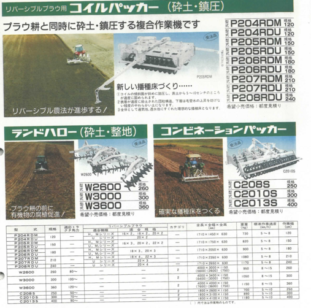
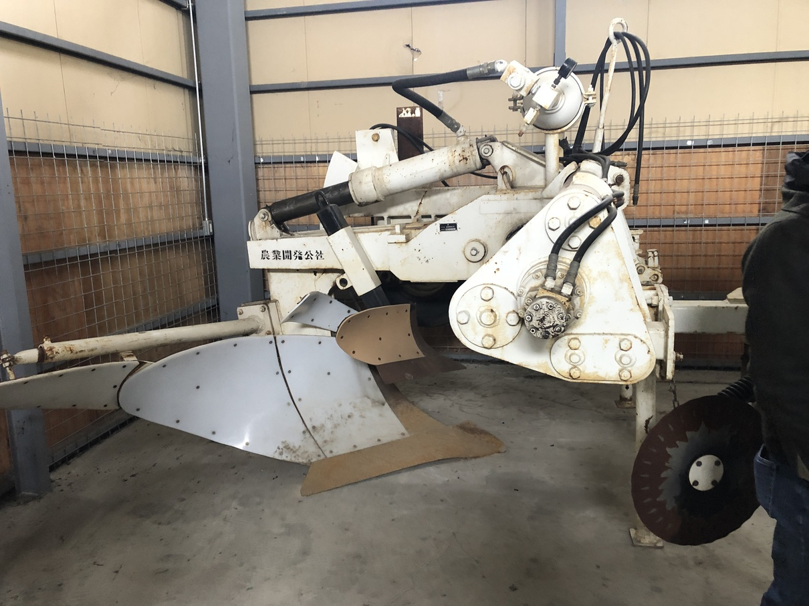
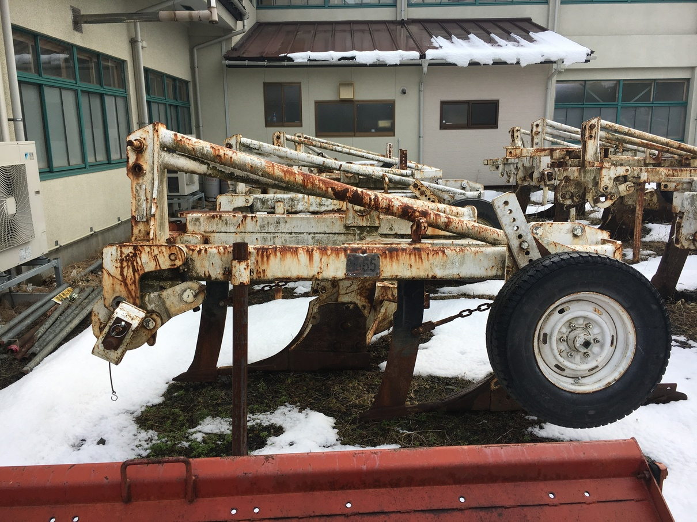

# スガノ農機
2006年頃のHPにスガノマニアックス、というコーナーがあり、宍道湖(しんじこ)の湖底プラウが載せられていた。
しかし、ほどなくしてこのコーナーは消えてしまった。

私が引き継ごうじゃないか！集え、マニアックなスガノ製品たち！！

## 心土肥培耕: 十勝の黒ボク土での作業

## プラウ耕(深)

アキュムレータのワンウェイ4連??

勝部さんのだが、24" 3連？見たこと無い。

謎プラウ森田のとこにあったやつかもスイングプラウ(仮)

スイングプラウの3連? 20" か。

森田のやつはL型2連、と書かれていた。スイングプラウではなく、L型プラウと呼ぶべきかもしれない。

3段耕

村井先生の記事から

混層されている様子

通常の?22"3？

# 特殊機械

ランドハローだけにとどまらず、コイルパッカーとかコンビネーションパッカーとか。

いわゆるプレス耕法の目論見はこのときからあったのか。

## 公社向けのやべぇ機械たち

パないっす。
初めて見たときは、本当に鳥肌が立った。
ここまで、北海道開拓に燃やす執念が宿った機械は、他に無い。
人の魂が感じられる機械、控えめに言って最高です。

# 籾がらプラウ

心土肥培耕みたいなものだけど、岩手県農業公社の籾殻暗渠のような感覚に近いのかもしれない。ハイブリッド

# 混層耕プラウ

言わずとしれた、30"プラウ、いくつかバージョンがある。

これは2018年に苫小牧に置いてあったやつ。

北見がちょっとおかしい

北見にへんなプラウがあった。

なんだろう。以上にフレームがゴツく、サポートホイールが2連あるし、スキマーも大きい。

花巻には、簡素化したような混層耕プラウがある(あった)。

# 分割混層耕プラウ

これはやばい。普通の2段耕に見えてセカンドボトムがオフセットしていない。なんじゃこりゃ。

# 3段耕

これは、おかしい。ホクノーの混層耕に始まり、小西のマンモス、UCB, そして改良反転客土耕プラウとして、この子が生み出された。
土地改良の神様。素晴らしい。

これは土の館に保管されてるやつ: 苫小牧から持ってきたんじゃなかったっけ。

2018年に苫小牧に置いてあったやつ: いま土の館にあるのとおんなじかな

# 草地用プラウ

草地用の24"2連プラウ: おそらく

花巻にあった、ナタコールタのプラウ

