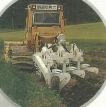

# スガノ農機
2006年頃のHPにスガノマニアックス、というコーナーがあり、宍道湖(しんじこ)の湖底プラウが載せられていた。
しかし、ほどなくしてこのコーナーは消えてしまった。

私が引き継ごうじゃないか！集え、マニアックなスガノ製品たち！！

## 心土肥培耕: 十勝の黒ボク土での作業

## プラウ耕(深)

アキュムレータのワンウェイ4連??

勝部さんのだが、24" 3連？見たこと無い。

謎プラウ森田のとこにあったやつかもスイングプラウ(仮)

スイングプラウの3連? 20" か。

3段耕

村井先生の記事から

混層されている様子

通常の?22"3？

# 特殊機械

ランドハローだけにとどまらず、コイルパッカーとかコンビネーションパッカーとか。

いわゆるプレス耕法の目論見はこのときからあったのか。
