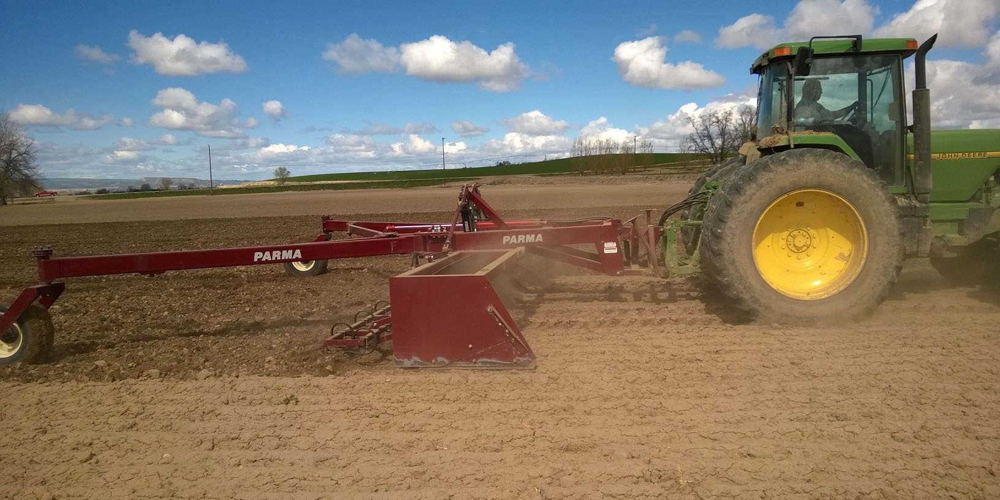
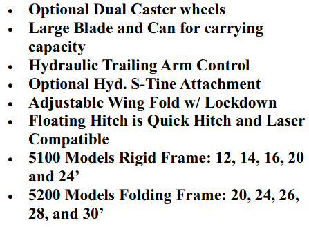
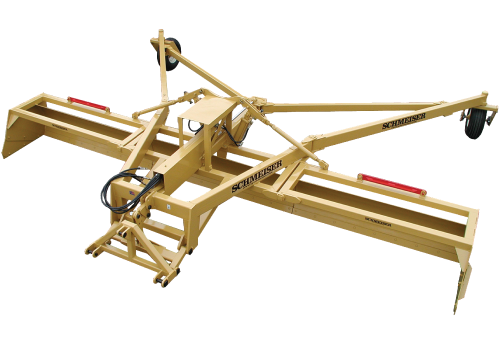
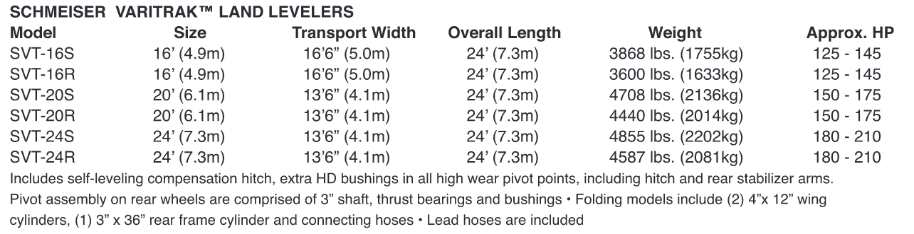
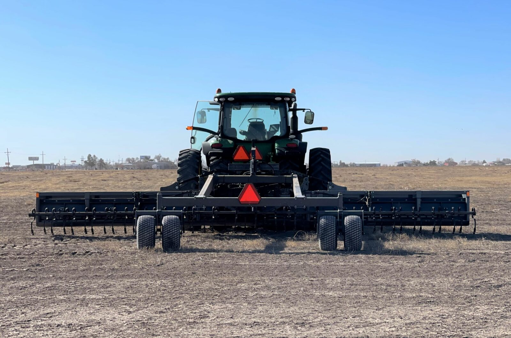
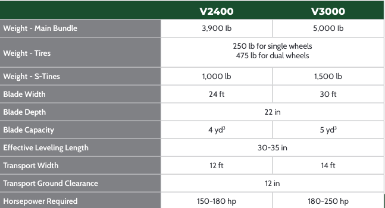
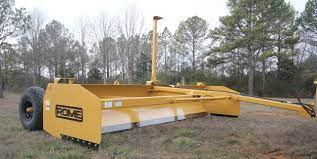
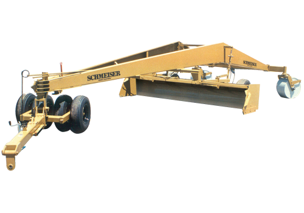
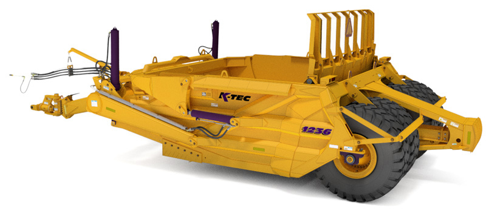

# アメリカのレベラー

## 折り畳めて200-300hpで引っ張れそうな．

- Parma, Schmeiser, Art's way を見つけました．
- folding model ですがランドプレーンなので均平の効率は未知数
- どれも3pt ヒッチ部がセルフレベリング(フローティング)するようなので良さそう.
- どれも 3pt ヒッチ(半直装)なので取り回しは良さそう.
- art's way , parma はスプリングタインがオプションでつけられそう．
- art's way のはリアシリンダがついているため高さ調節しやすそう．

- この3種類だったらart's way が良さそうに見えます．パーツ供給がどの程度かわかりませんが... 

##  [Parma Folding land plane ](https://parmacompany.com/ag-equipment/tillage/land-plane/folding-land-plane/)

###  [カタログ](https://parmacompany.com/wp-content/uploads/2017/08/2015-LAND-PLANE.pdf)

## [Schmeiser VARITRAK 3PT Land Leveler](https://www.tgschmeiser.com/products/landlevelers/3pointlandleveler.html)

### [カタログ](https://www.tgschmeiser.com/pdfs/Open%20Field.pdf)

## [Art's way land planes](https://artsway.com/equipment/)

### [カタログ](https://artsway.com/wp-content/uploads/2023/07/Dirt-Work-Web-Spreads.pdf)

(24ft は44389ドルから!!)

- folding ではないレベラーは現場で組み立て
[K-tec ](https://www.youtube.com/watch?v=ZpQb3bLyWrE)

## 分類
大まかに３種類のレベラーがあると勝手に分類しました．

1. ボックススクレーパー(レベラー), ドラグスクレーパ, ボトムレススクレーパ
(Box scraper, box leveler, drag scraper, bottomless scraper)

    - 牽引式でブレードにサイドプレートがついたボックスをリアタイヤのシリンダで高さを調節し表土の削り取り，敷き均しを行う．
    - ボックスは上下に解放されており，スクレーパーに比べると運土の効率は小さく(土のこぼれ・溢れ),大型のほ場だと効率が低下する可能性がある．
    - ヒッチーリアタイヤ間の距離が短く取り回しは一番しやすそう．
    - GNSSやレーザーと組み合わせて精密なレベリングが可能?

2. ランドプレーン, トリプレーン
(Land-Plane, Tri-Plane)

    - 使い方がよくわからないです．
    - 牽引式のブレードでサイドプレートがついていたりいなかったりする．
    - ボックススクレーパとの一番の違いはリアタイヤの上下がないことか．- 固定された3点のタイヤが地面の起伏を取るけど，幅もタイヤ間距離も長くすればただ引っ張るだけで地面は「ある程度」平らになるよね，という機械だと思われる．
    - ボックススクレーパよりもレベリングの効率はよくなさそう．
    - 運土量は少なく，起伏の少ないほ場に使用されるか．
    - Traditional な機械でメンテナンスは少なさそう．

3. スクレーパー
(Scraper)

    - スクレーパといえばこれ．
    - 運土量が大きく造成の効率は恐らく一番これがよい．
    - ブレードでボールと呼ばれる腹に土を抱え込み，必要な場所まで運びイジェクトして均す．
    - しかしながら，大きすぎるしトラクタで使う場合には専用のヒッチが必要．
    - 高そう．

## メーカー
- [sweco](https://www.swecoproducts.com/)

    - カリフォルニアのレベラー会社, 色々水田関連の製品を作ってる．

    - しかしながら，ストビューの結果，なかなか汚い会社.

    - 品質は高くなさそう．

- [ROME](https://www.romeplow.com/)

    - ここは馴染みのある(Rome の重デスクは北海道開拓にも使われた)会社．

    - レベラーのサイズの展開も豊富

- [K-tec](https://ktec.com/)

    - カナダの会社.

    -  でかいスクレーパーがメインでボックスレベラーもいくつか作ってる．

    - 日本のソーラー現場にはここのが入ってるはず．

    - でかいのばかりかと思えば，折りたたみのボックスレベラーもある．

- [SHoule](https://www.shoule.com/agricultural-equipment.php)

    - カナダのshoult みたいな会社．

    - スノーブレード・ブロワーの種類が豊富．

- [Notch](https://www.notchmfginc.com/index.html)

    - ベールグリッパやトレーラも作ってる．

    - rand levelers は４幅展開．

- [Schmeiser](https://www.tgschmeiser.com/products/landlevelers.html)

    - ボックスレベラーもあるし，，ランドプレーンも作ってる会社．
    - この界隈では老舗か．

- [Rayne Plane](https://www.rayneplane.com/)

    - なんというか，この辺になってくると，運土量が少ない場合のレベラーになってくる．

    - とにかく長い．

    - 運土量の大きいものはボックスレベラーというよりも，スクレーパーになるのかも．

- [Parma](https://parmacompany.com/ag-equipment/tillage/land-plane/)

    - ランドプレーンといってるけど，Schmeiserのような大型のものではなさそう．

    - 折りたたみのランドプレーンがある．

    - 他にも色々作ってる．

- [Loepky](https://www.loepkymfg.com/page/page/1664451.htm)

    - テキサスの会社，2枚ブレードでただ引っ張るだけ．

    - バケットブレードという名のボックスレベラーもある．

- [Scott](https://scottlandplanes.com/)

    - なぜかHPの画像が表示されない．FBの方は生きているかも．

    - 大型のランドプレーンを作ってる会社．

    - いわゆるTri-plane はフロント鉄輪1つとリア鉄輪２つの３点でブレードを懸架し，レベルしようとするもの．

- [PortersWelding](https://porterswelding.com/)

    - 色々作ってそうな．
    - Swecoに似ている．同じカリフォルニアだし．

- [Art's way](https://artsway.com/equipment/)

    - 色々作っている.

    - [カタログ](https://artsway.com/wp-content/uploads/2023/07/Dirt-Work-Web-Spreads.pdf)

    - 折りたたみのランドプレーン
    - オプションでスプリングタインがついている．
    - 表層の圧密を抑えて表面滞水が抑えられるかも．

    - 作業幅と移動幅は24ftで12ft, 30 ftで 14ft の2種類

- [Orthman](https://orthman.com/soil-moving/)

    - あのorthman もレベラーを作っていた．
    - 小型のスクレーパも作っている．
    - 幅は小さめ．

- [NAMMCO](http://nammco.net/Landgraders.asp)

    - ランドグレーダーやスクレーパーを作っている．
    - Levee 関連のパッカーやディスクは畦畔造成に使えそう．
