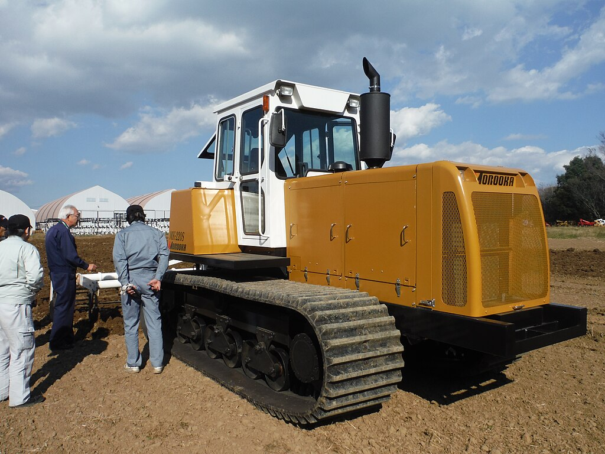
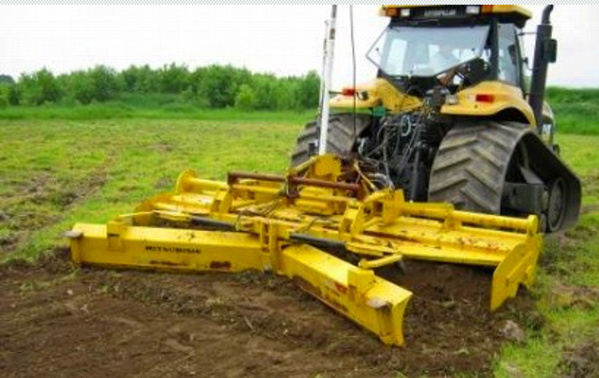
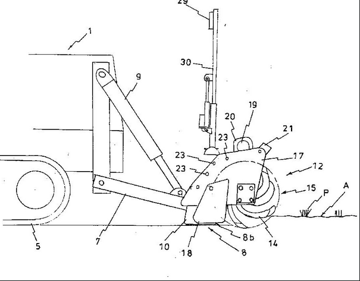

# ゴムクローラのパイオニア諸岡

牛久沼のほとりにある株式会社諸岡，現在こそ商品のラインナップが絞られているものの，ひと昔まえはとても暴れていた．
失敗を恐れない挑戦的な試作品の数々は，現在は製品化されていないものが大半だが，「現場の仕事を楽にしたい」という開発者の思いがこもっており，経営戦略に沿ったもの，セオリー通りの農業機械開発という常識を破った，独創性を感じずにはいられない．
使えるかどうかは別として，油圧モータを駆使した農業機械の七変化に我々ファンは惹かれてしまう．
本書では数あるモロオカの製品のうち，「農業用ゴムクローラトラクタ」関連の機械に焦点を当て，開発の当初からラインナップから消えてしまう2003年くらいまでの足跡を追って見たいと思う．

# 写真貼
[写真たち](./worldTractor.md)

# 日本農業機械新聞の記事
日本農業新聞をひたすら見て，モロオカ関係の記事があるところを拾った．まだ見落としがあるかもしれない．
## 
# 勝手に歴史
[会社の沿革](https://www.morooka.co.jp/company/history) と
[youtube の会社案内](https://www.youtube.com/watch?v=EO0QuQMJbwk)と
手持ちのカタログを参照して歴史をまとめてみる．

- 本社跡や苫小牧工場，熊本工場の跡地については[別ページ](./ruins.md)

# 創業 - 1980年
- 1958年 土木・建設の会社としてスタート
- 1971年 株式会社諸岡　に社名変更
- 1975年 全油圧式トレンチャー，ブルドーザ，不整地運搬車の販売開始
  - MT-300 型トレンチャー, MT-500型トレンチャー
    - MTはMorooka Trencherの略称か．
    - MT-500L はMT-500とクローラが異なり，長く，重い．
    - MT-300は370万円，MT-500は500万円程度．
    - MT-1500 (150馬力)は農業土木用として開発されていたらしい(カタログ裏面文字のみ)
    - 埋め戻しのためにハイブルをご利用くださいとのこと．セットで使用することを想定していたのたかもしれない．
  - MB-22 型 モロオカ ハイブル
    - 土木工事・農作業1台で2役
    - 非常に低い接地圧(0.1kg/cm^2)であるため，泥濘地での様々な作業に対応．
    - リアヒッチ(油圧シリンダで角度変更可能な角パイ)に排土板，明渠用プラウ，弾丸暗渠施工機械等の作業機を装着可能.
    - 235万円程度の価格．
  - MS-30 型 モロオカ ハイショベル
    - コンマ4程度のバケットを装着したトラクタショベル
   
- 1978年 幅500mm のジャンボクローラ　超湿地運搬車 MST-500を発表
  - モロオカ・ハイトラック　MST-500
    - 1本レバーで，女性でも楽に運転，大きな荷台でスピーディーに．
    - ブリヂストンと共同開発した特殊ゴム履帯
    - ダンプ機能で土砂運搬をしたり，ユニックを取り付けて暗渠菅やトラフ運びで大活躍．
    - 簡易キャブ付きもある．
  - MST-500s 1982年
    - MST-500の改良版
    - 最大移動速度とか大きさが異なる．
  - MST-300 1982年
    - MST-500は51馬力エンジンであったが，MST-300は30馬力のエンジン.
    - 徐々にラインナップを増やしていく．
  - MST-1000型
    - 当時としては最大か．
    - ゴムクローラ高速キャリヤ，，省エネ型，スチールキャブ，が売りらしい
    - 82馬力のエンジンを利用．
  - このくらいまでがオレンジ色．

# 1980年 - 1990年
## ゴムクローラトラクタ黎明期: 龍ケ崎の工場でほそぼそと，何か形になるものを作っていた．準備段階.

- 1980年 ついに農業用トラクタ.

MBとかMSとかに，リアヒッチ，と呼べるかわからないような簡易装置をオプションとしていたことからも，何かしらの農作業をしたいという思いがあったことがうかがえる．
MB-50, MB-30の大型機に改善されたリアヒッチが取り付けられたことによって，その思いはより具体的なものへとなった．
  - MB-50, モロオカ，トラクターショベル
    - ハイショベルから名称が変更され，トラクターショベルとなった．
    - それもそのはず，立派な3点リンクヒッチが架装され，PTOも搭載された．
    - エンジン馬力は50Psであり，PTO馬力は10-50馬力と記載されている．
    - PTO は油圧モータではなく，直結，ということだろうか．クラッチはあったのだろうか．
    - もちろんバケットはついており，容量はコンマ5程度．
    - カタログにはロータリやビーチクリーナが装着された写真が掲載されている．

- 1981年　モロオカ　トラクター　
ついに，トラクターと名乗り始めた．
キャッチコピーは
```
世界初の前後進クローラトラクター
押してもだめなら......引いてみろ!!
プッシュプルトラクター，50馬力無段変速
```
である．
  - P.P 3000, P.P 5000 (開発名称 MIG5000)
    - P.P はPush. Pull であると予想．
    - MB-50からバケット取り外して，シートを回転できるようにしたものか．
    - PTOも搭載しているようだが，油圧モータか．カタログには全油圧式と銘打ってある．

- 1983年 It's another world
クローラキャリヤのラインナップを拡充，モロオカらしいヘンな車両が登場してくる．
クローラキャリヤは31馬力から110馬力までのMST-300, 600, 800, 1100 とバージョンアップした4種類．
総合カタログにはIt's anoter world と書かれており，1100以上の大型機種の開発に着手していたことがうかがえる．
ハイブルはMB-50T へ，ハイショベルはMS-50, MS-30 へバージョンアップ．
特筆するべきは次の2機種．
  - SCOOP 03, SCOOP 05
    - タイヤ式でスキッド式？のタイヤショベルの可動域広くなったやつ，みたいな機械．
    - 世界で初めて生まれたショベルとバックホーの兼用機，
    - 水陸両用でスピーディな作業が可能な万能車
    - 03は33馬力，05は50馬力らしい
  - P.P 3000, P.P 5000
    - クローラ草刈車
    - 大型の草刈り機は，堤防や原野の草刈りに使われる．
    - 農業開発事業団，建設省，中国地建等に採用されている．
    - 密閉キャブで粉塵対策，エアコンはあるのか．
    - 3000は42馬力で刈幅1600mm, 5000は50馬力で刈幅2000mm.
    - このP.P はPush-Pull トラクタのP.Pをそのまま使用したものと思われるが，キャブは草刈車専用のものと思われる．
    - 斜面草刈の歴史については，[別ページ](./leeveeMow.md)

- 1985年 -1990年　混沌視界不良
資料が少なく情報が薄い．
しかしながら奇妙な機械が醸成されている
    - MJ100
        - 高速型のクローラダンプ，
        - パラシュートを引いている絵が印象的
    - ゴムクローラ　トラクターシリーズ
        -  高速トラクターシリーズ 40馬力- 275馬力？？
        - D210K, D210M は40馬力，それぞれ小松と三菱エンジン
        - D310は110馬力
        - D410 は130馬力
        - D 510 は275馬力
        - ロータリー，スタビライザー，ブッシカッター草刈機，道路切削機
        - D310, 410, 510 は走行がHSTシステム
        - キャッチコピーが面白い．
        ```
        前方につけたブレードで境界をとり，後方のロータリーで田畑を耕す-村１台- 農業生き残り機械
        トラクターの大革命を拓くMOROOKA はここでも使われている
        ギーギー，ガタガタが全く感じられない乗り心地
        ```

        これらの機械は，小松や三菱の農業用トラクタにゴムクローラを履かせただけではないのだろうか．
        特にD210K は小松のD20, D210Mは三菱のブルに見える
    - ゴムクローラ　トラクターショベルシリーズ
        - こちらは以前のMSシリーズの発展形だろう．
        - 年代は不明であるが，MS-25, 45, 55, 150, 200!! とサイズ展開が豊富になった．
        - バケットももちろんついていて，サイズは大きい．

# 1990 - 2000年

- クローラトラクタ全盛期の時代．
- 小型機種から大型機種まで多様な種類のクローラトラクタを展開．
- 水田農家を中心として，北海道，北陸で広く普及した．
- Morooka Adventure シリーズが登場．
- トラクタやキャリヤダンプなどを一新，波に乗り始める．
- 1990年5月: 苫小牧工場完成: 式典の様子
- 1990年9月: MCTシリーズの製造販売開始: 

- ゴムクローラートラクター MCT シリーズ ADVENTURE(1990??)
    - 赤い，モロオカトラクタ
    - MCTはMorooka Challenger Tractor の略，という噂も．
    - 何はともあれ，国産初の量産トラクタ
    - MCT-80, 100, 150, 200, 250 の５シリーズ展開
    - また力強いキャッチコピー
    <!--- 農業新聞リンク must buy
        - [昭和63年04月26日](http://www.shin-norin.co.jp/shop/50_2587.html)
        - [平成1年07月18日](http://www.shin-norin.co.jp/shop/51_2647.html)
        - [平成3年7月23日号](http://www.shin-norin.co.jp/shop/51_2746.html)
        - [平成4年6月02日号](http://www.shin-norin.co.jp/shop/51_2789.html)
        - [平成7年12月05日](http://www.shin-norin.co.jp/shop/52_2959.html)
        - [平成8年08月27日](http://www.shin-norin.co.jp/shop/52_2993.html)
        - [平成10年08月11日](http://www.shin-norin.co.jp/shop/52_3089.html)
        - [平成17年09月20日](http://www.shin-norin.co.jp/shop/54_3433.html)
    -->
    
    ```sh
    トラクターの大革命
    国際競争に勝てる- 世界戦略トラクター
    ```

    - [端先生の論文](https://www.researchgate.net/profile/Kenshi-Sakai/publication/37552404_TILLAGE_OPERATIONS_BY_RUBBER-TRACKED_TRACTOR_WITH_HYDRO-STATIC_DRIVE/links/00b7d51e9cce5bebb0000000/TILLAGE-OPERATIONS-BY-RUBBER-TRACKED-TRACTOR-WITH-HYDRO-STATIC-DRIVE.pdf?origin=publication_detail)
    - [高井先生の論文](https://www.jstage.jst.go.jp/article/jsam1937/53/Supplement/53_Supplement_51/_article/-char/ja/)

- ゴムクローラー　ゲレンデ整備車 MGM ADVENTURE(1990?-1991?)
    - これから始まるモロオカのナニコレ車両系第１段, MGM-180, MGM280
    ```
    四季を通じ世界のスキー場でお役に立ちます．
    超幅広のゴムクローラ(1000mm, 1300mm)は，誰でも簡単に操作が出来，しかも走るだけで正確に能率よく圧雪出来ます．
    最高速22km/h で移動も早く舗装の上も走行可能
    冬はもちろん，夏のゲレンデ整地，草刈りに最適です．
    ```
    うーーーーん，幅広のゴムクローラはやばい．
    ゆきみらい1991@上越ではMGM280が展示されていたらしい．
    このゆきみらいではMT-70なるロータリ除雪車(MM改造？)もあったみたい．
    [建設の機械化 1991 April](https://jcmanet.or.jp/bunken/wp-content/uploads/1991/jcma-1991_04.pdf)

    MGM-200なるゲレンデ整備車を1990年の冬とぴあで展示していた，ということはMGM280は1990年の機械でゲレンデ整備者は1989年には開発していたことになる．

    1992年のゆきみらいでは展示しなくなっちゃった... 


- トラクターシリーズ ゴムクローラー　 MK シリーズ(1991-1997)
    - MCTからMKにモデル変更．
        - MK はMorooka Kazuo諸岡一雄さん
        - ラインナップがとんでもないことに．
        - MK-40, 60, 80, 100, 120, 140, 160, 200, 220, 240, 260, 280, 300と13機種のラインナップ，
        - やる気に満ち溢れている．
        - モロオカトラクター株式会社という会社を同じ敷地内に．
        ```
        日本で生まれ世界に育つ
    - Morooka Tractor (1993)
        - マイナーチェンジを重ねながら，現場に浸透していく．
        - MK-20, 30, 40, 50, 60, 70, 80, 90, 100, 120, 140, 160, 200, 220, 240の15種類！！
        ```
        トラクターの大革命を拓くMOROOKA Tractor
        冷害を克服し復田を実現するモロオカトラクター
        ```
        - スライド式などもこの時期
        - [高井先生の報告](https://eprints.lib.hokudai.ac.jp/dspace/bitstream/2115/13413/1/28_p1-8.pdf)
    - ゴムクローラーのトラクター　小型シリーズ
        - いろいろマイナーチェンジをする中で，小型シリーズも生まれた．
        - MK-25, 30, 35, 45, 55, 65
        - MK-25と65は排土板つき
        - MK-35,45,55はフォークリフト付き？？
    
    - 年々大型化する農業トラクターとマーケットシステム　農建トラクター

- トラクターシリーズ ゴムクローラー　 MK-S シリーズ(1997-)
    - キャビンの安全鑑定を受け，MKシリーズがSになった．
    - ポジション自動水平機能と国際規格の三点リンクが装着された．
    - 三菱農機，コマツ，クボタ，イセキ，エムエスケー，ニューホランドからトラクターが販売されていたことがカタログから判明した．
        - エムエスケーは三菱グループだから，MKMで三菱農機が積極的にクローラトラクタを販売していたことからまだ理解できるが，ニューホランドは全く不明．なぜ．
    - この時期が一番面白い機械(世の中にない機械)を製造・試作していたと思う．
    - 1998年の総合カタログには，
    
    > 日本の大手メーカー(コマツ，日立建機，クボタ，三菱農機，井関農機，MSK東急，日本ニューホランド)とのOEM供給により大量生産を可能にし，トップシェアを確実なものとするとともに，日本をはじめ世界各国に約6万台の販売実績を持っています．
    
    と書いてある．

    日立建機，はキャリアだろうか．もしトラクターならば...
    
    - MSK東急のトラクターは丸ハンドルMK-Rシリーズで販売されていた．


- 変な機械たち(素晴らしい)
    - 大型管理作業機 ハイクリアランストラクター  MT-50(1997年) (モロオカなのに車輪)
        - 今世紀最大の発明 ゴム車輪トラクター！
        - HSTで無断変速で自動走行可能
        - 非常に軽量でコンパクト，レンコン田の泥深い田を走行し，超微速を選べる．
        - 最低地上高は抜群で，重心が非常に低い．
        - 馬力あたりのトラクターの重量は世界１軽い(50PS, 1880kg)
        - 前輪8万円，後輪18万円
        - 平成10年の農機展ではMKT-50として展示されていた．[畜産大のHP](http://univ.obihiro.ac.jp/~fmsatow/old_hp/old_lab/am_photo/tractor/morooka1.jpg)
        - 前輪は920mm，後輪は1550mm
        - これは丸ハンドル

    - トラクターショベル MH-38 (モロオカなのに車輪2)
        - ゴム車輪ハーベスターの発明
        - 非常に軽量でコンパクトのため，レンコン田(深1000mm)の泥深い田を走行し，超微速でレンコンを収穫することが出来ます．
        - 走行は全油圧式，前後進は無断変速で，自動走行することが出来ます．
        - エンジンから出る強い空気がバケットの先端に吐出させる．また，ノズルの先端からは水とエアーが出る仕組みに加え，バケットの振動でレンコンの根を切り，水面に浮くレンコンを収穫します
        - 作業機を取り外し，バケットを取り付けて堆肥の切り替えや運搬作業が出来ます．
        - ゴム車輪には外径920mm と1330mmと1550mmの3種類がありますので，深さに応じてお選びください．また建設用のホイルもご用意しております．
        - これは２本レバー

    - マルチトラクター MTT-38(1998年7月) (モロオカなのに車輪3)
        - レンコンハーベスター，草刈り，ライスハーベスター，防除，肥料散布，掘削，運搬と積込み
        - 車輪径920mmでダブル
        - 写真はMTT-18
        - これも丸ハンドル
    
    - 高速トラクター MK-H(1998-)
        - Hシリーズは超高速トラクター
        - 標準仕様のトラクターに比較して，ほぼ倍速. 70馬力で30km/h, 90馬力で35km/h出る．
        - 同じ馬力帯であっても50万円ほど高い??
    
    - スライド式管理機 MK-A, MK-V(1999-2001)
        - クローラのトレッド幅が可変するMK-V.
        - クリアランスが可変するMK-A.
        - モロオカ変態機械衆の最後か． 
    
    - ゴム車輪フォークリフト MF(1999?-)
        - 水田の中も走れるゴム車輪フォークリフト MF-08, MF-15
        - ゴム車輪外径は770mm-1330mm
   
    - ブルドーザー MD (1999?)
        - 超々湿地ブルドーザーでチルトアングリング付
        - 世界一軽いHSTのブルドーザー
        - 自動の均平装置がつく
        - 農業土木の仕上げ作業に最適
        - 鉄のリンクシューより3倍長持ち
        - MD-3, 4, 5, 6 で80馬力-140馬力のラインナップ
        - どんな機械も入れない現場にスムーズに入る．

- そして終焉へ(-2003年3月 製造終了?)
トラクタに関しては，MK-SをベースとしてMK-AやMK-Vなど変態機械を作り出し，キャリアやショベル，粉砕機など環境機械にシフトしていく．
    - ゴムクローラートラクターを発明して13年 7000台の実績(2002年4月)
        - MKシリーズの五大特長
        - 誰でも簡単操作の２本レバーで，前後左右のスピードをコントロール出来ます．
        - 泥離れの良い山高クローラーは大きな牽引力と低接地圧を実現
        - 自動ポジション水平機能と国際規格の三点リンク付き．
        - 制御装置は二系統. 
        - 駆動システムはH.S.T
        - ラインナップはMK-100S, 140S 160S の3種類...

- 2003年4月のHPから農業用トラクタ，ゴムクローラトラクタの表記は消えてしまった．

")
*2003年2月HP 商品案内(Wayback machineを利用してキャプチャ)*

")
*2003年2月HP 仕様(Wayback machineを利用してキャプチャ)*

")
*2002年HPに掲載されていた写真(Wayback machineを利用してキャプチャ)*

")
*2002年HPに掲載されていた, キャリアダンプに搭載された小型バックホー, 詳細不明(Wayback machineを利用してキャプチャ)*

- 2018年に帯広で開催された国際農業機械展示会に、久方ぶりの試作機としてトラクタが展示された。このときは写真撮影禁止であり、参考出品であった。今後も発売する予定はないとのこと。
現在は動画用におそらく阿見のテストフィールドに置いてある。

*2024年1月1日現在wikipedia より転載。*

(この写真、某白い農機の試験ほ場では...? 上げて良い写真だったのだろうか)
これにてモロオカ農業用トラクタ,　おしまい.

# 一般社団法人　日本農業機械化協会の，農業機械化ニュースに現れるモロオカ

- H11 8月: 農用フォークリフトに関する記事

特殊車輪を採用した不整地対応型の農用フォークリフトで，ハウス内の作業から超湿田にまで対応できる。また，ハンガーマストの採用により本マストの伸縮に関係なく動くためクリアランスがとれ，４軸駆動によりその場旋回ができる，触媒方式により排ガスの黒煙を解消――などの特徴を持つ。 

- H12 6月: 三菱農機のゴムクローラトラクタ販売

　12年度下期の新製品として発売するもので，クローラの課題とされる移動速度は最高で毎時15kmを実現した。また，車輪式トラクターＧＸシリーズで採用している先進のマイコン「ＭＡＣ・Ｓシステム」をクローラ用にアレンジして搭載。ＭＡＣの「入」「切」や設定状態がひと目でわかる液晶パネル「マックビジョン」をメーターパネル内に設置したほか，ハンドル手元のクイックアップレバーや主変速を「後進」に入れると作業機が自動的に上昇するバックアップ機能，また作業機の傾斜・耕深はもちろんドラフト制御も可能なマイコンドラフト（Ｓモード）付きとし，高精度作業ができる。 　そのほか，業界初の後方レーザーシステムによりプラウ，ハロー，ロータリに簡単に装着して大区画圃場の均平化が実現でき，ＰＴＯは３段変速，ハイ／ローの切り換えがワンタッチボタンなどの特徴をもつ。ＭＫＭ45（46馬力）～ＭＫＭ75（75馬力）まで４型式ある。

- H12 9月: ハイクリアランスタイヤ

トラクター用の特殊タイヤで，直径1300mmのハイクリアランスタイヤを始め，直径800，920mmなど各種揃っている。いずれのタイヤもトラクターへの取り付けは簡単にでき、銘柄に応じて農機店・農協農機センターなどで調整する。


# 未解決問題

何個もある

- MITSUBISHI のカッティングレーザーロータリー



MACの遺産だと思われるが正体は分からない．
画像だけが手元にある．

チャレンジャーに装着されている画像だが，これは諸岡のイエローだと思われる．

関連特許かわからないが，[「特開平９−３２２６０７」](https://www.j-platpat.inpit.go.jp/c1801/PU/JP-H09-322607/11/ja) はいかつい．





これを，逆にしたものだろうか．

いや、これだわ: 均等作業機(20250325)
- [特願平09-329758](https://www.j-platpat.inpit.go.jp/c1801/PU/JP-H11-113312/11/ja)
がアイディア段階で、
- [特開2000-041408 ](https://www.j-platpat.inpit.go.jp/c1801/PU/JP-2000-041408/11/ja)
がチャレンジャーにつけてるバージョンの図面。
