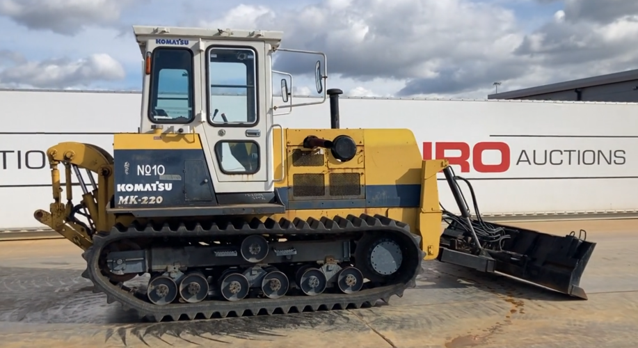

# 世界のモロオカ

- [MK300@Boston 1997](https://www.facebook.com/293294154034235/posts/and-now-for-something-completely-different-this-morooka-mk-300-was-taking-part-i/2449500025080293/)

Classic Tractor Magazine の2019年のFacebook ページからの転載．

- [Morooka のwiki](https://tractors.fandom.com/wiki/Morooka)

- [Farm Show Magazine 1993 volume #17](https://www.farmshow.com/a_article.php?aid=8320)

Farm show magazine 1993 #17より記事を転載．
## Latest New Products, Ideas From Europe

### Japan Rolls Out Line Of Rubber Track Crawlers

Latest new competitor in the fast-growing market for rubber track crawler tractors is the Morooka Co. from Japan. 
"Competing machines are bigger, heavier and more expensive. Ours are lighter, simpler and cost less," notes Morooka, which has marketed crawlers in Japan the past 10 years.

The patented new Morooka rubber track design was developed jointly with Bridgestone.
Tracks are driven by a front idler sprocket.
Its teeth mesh into grooves on the underside of the rubber track to provide a positive drive.
A two range fully hydro-static transmission provides power to the idlers.

Steering, unlike other makes which use a wheel, is with two levers -- one for each track.
You push them forward to move ahead and back to reverse -- at infinitely variable speed.
There is no clutch pedal, no brake pedal and no gear shift lever.
A 3 pt. hitch and pto (880 rpm) are standard.

Two models, both with Komatsu engines, are being introduced in Britain ù the 100 hp MK-100 and the 220 hp MK-220.
Britain's Farm Contractor magazine notes that "compared to the Caterepillar Challenger, the Morooka crawlers may lack a certain finish.
However, they appear to offer a fair degree of robustness which could conceivably appeal to custom operators.
It's an appeal which could be further enhanced when it is known that the 220 hp version sells for significantly less than other similar designs."

Contact: FARM SHOW Followup, Yuasa Warwick Machinery Ltd., Rothwell Road, Wedgnock Industrial Estate, Warwick, England CV34 5PY (ph 0926 497806).

- [JAなんぽろ　くみあいだより 2022 April](http://www.ja-nanporo.or.jp/wp-content/uploads/2022/04/bd47e9c206f6be3b6f54a296e82a6ec5.pdf)

- [MK-220 @ EURO Auctions](https://vimeo.com/696464778)

[Online Bidding](https://www.euroauctionslive.com/servlet/Search.do?auctionId=678&itemId=925568&catalogLink=auctionId%3D678%26categoryName%3DTractors)
花巻にあったやつ, 2017年にはエンジン始動の動画を撮影していた．No.10
Leeds, GBにあるという，2022年にイギリスへ渡ってしまった...

- [MK-250@オークション](https://x.com/kenkinosuke/status/1628740621740687360?s=20)

これも花巻にあったやつか．No.12
