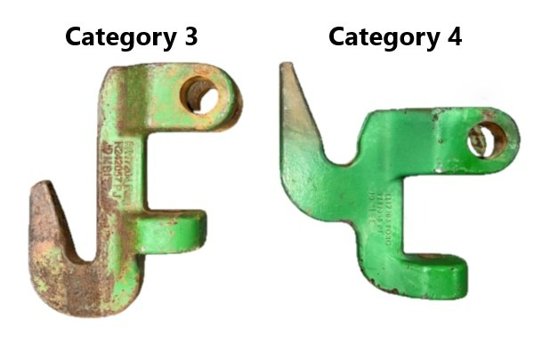

# たまに見る，変なクイックヒッチについて 

こんなクイック．

なんで上2つ，しかも逆さまなのか．

そもそも，ASAEのクイックヒッチの規格は1, 2, 3N, 3, 4N, 4のような種類がある．
- [参考1](https://www.leeagra.com/boss-quick-hitches/quick-hitch-link-dimensions)
- [参考2](https://www.tractorbynet.com/forums/threads/is-there-a-standard-quick-hitch-height-for-the-top-hook.388498/)

MT800のパーツカタログを眺めると，

の8と9で，これは，

をみると，HOOK ASM(CAT 3)とHOOK ASM(CAT 4)のようである．

でも，ちょっとサイズが飛躍しすぎだし，１枚目の写真には，CATEGORY 3&4 NARROWとあるから，9のHOOK ASM(CAT 4)はHOOK ASM(CAT 4N)の間違いだろう．

Cat 4 のヒッチは，フックの部分は逆さまになっておらず，専用である．

[こんな物](https://www.tractorhouse.com/listing/for-sale/223567959/2022-agco-cat-4n-hitch-farm-attachments)もあるくらいだから，頻繁に切り替えるということがあるということなのか．cat3のフック、作業機取り付けるのちょっと大変そう。

[トラクタはcat4だけど、つけたい昔のプラウがcat3なんだが](https://talk.newagtalk.com/forums/thread-view.asp?tid=442749&DisplayType=flat&setCookie=1)
というような，掲示板に対して,

The only difference big between 3 and 4 is the center hook is higher up on 4.
On the two point side 3N/4N(narrow) are the same and 3/4(wide) have the same measurments.
The hooks on 4(two point) are a little wider on the inside over 3.(outside measurements are the same)

とある．

deere のフックを見ると

というように，確かに高さが違う．

似たような，cat3とcat4をスイッチしやすくするクイックヒッチはいくつかある．

[CASE IHの2段のやつ](https://www.servicemotor.com/fckimages/pdf/PM-11881.pdf)
とか，
[case ih の入れ替え式のやつ](./img/case_qh_1.jpg)
とか．

cat3とcat4の作業機を頻繁に付け替えることってないと思うけど，まあ確かに1本で複数台行ければ結構便利か．

ちなみに，ドローバーも色々あるけど，スクレーパのヒッチも色々あって，

や

などがある．
