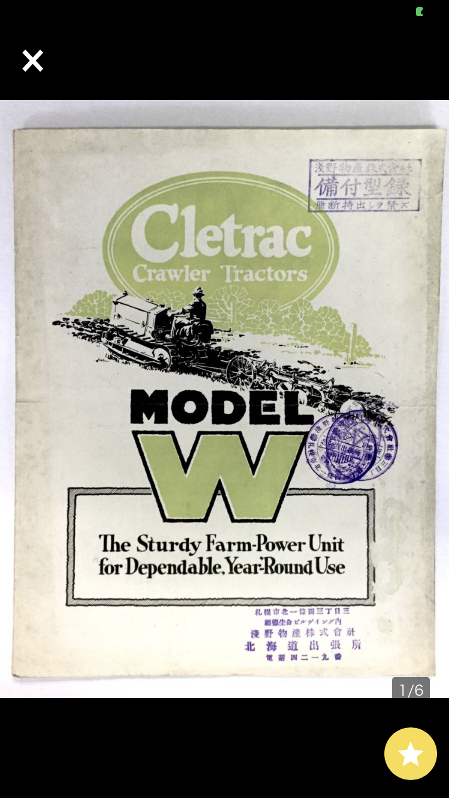
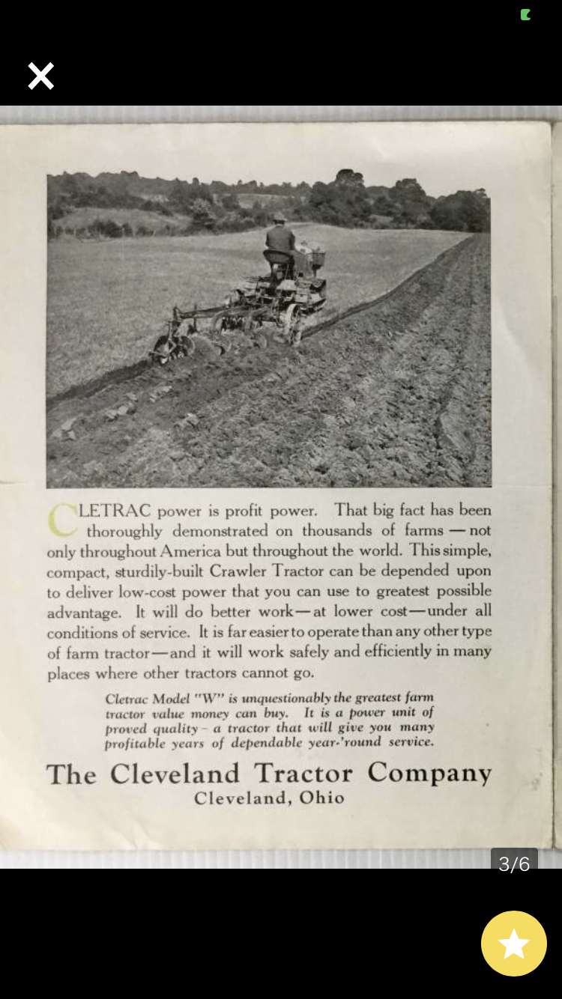
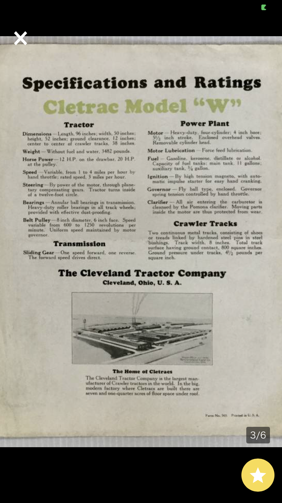
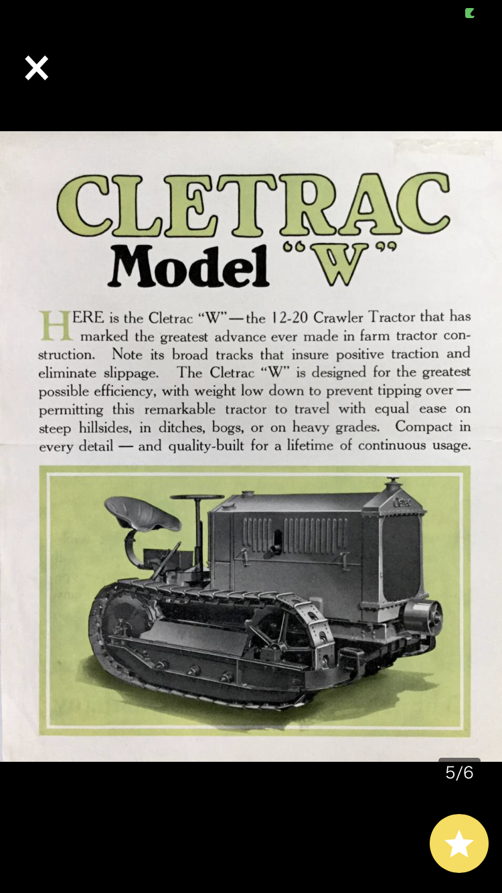
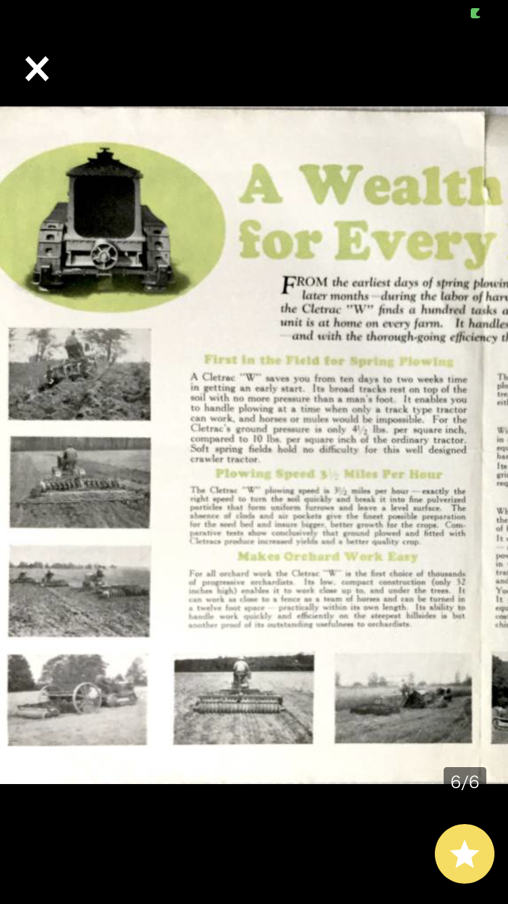
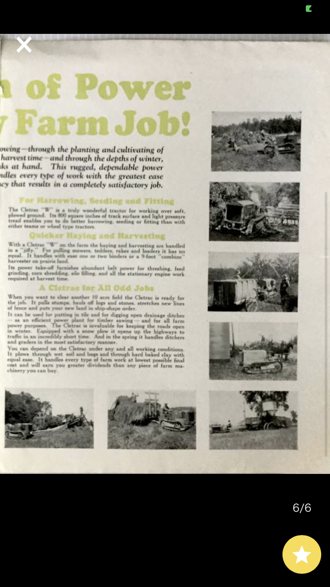
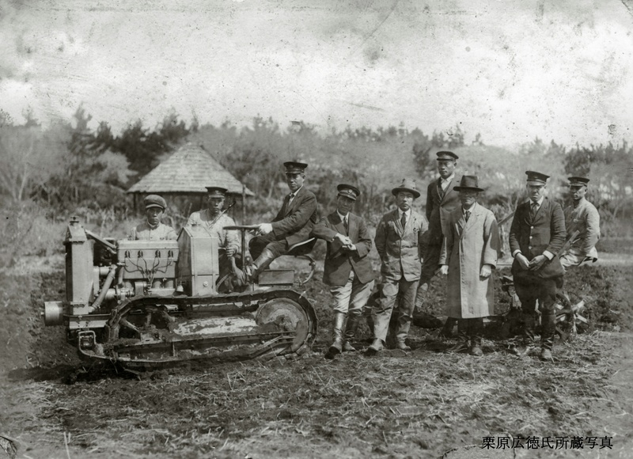
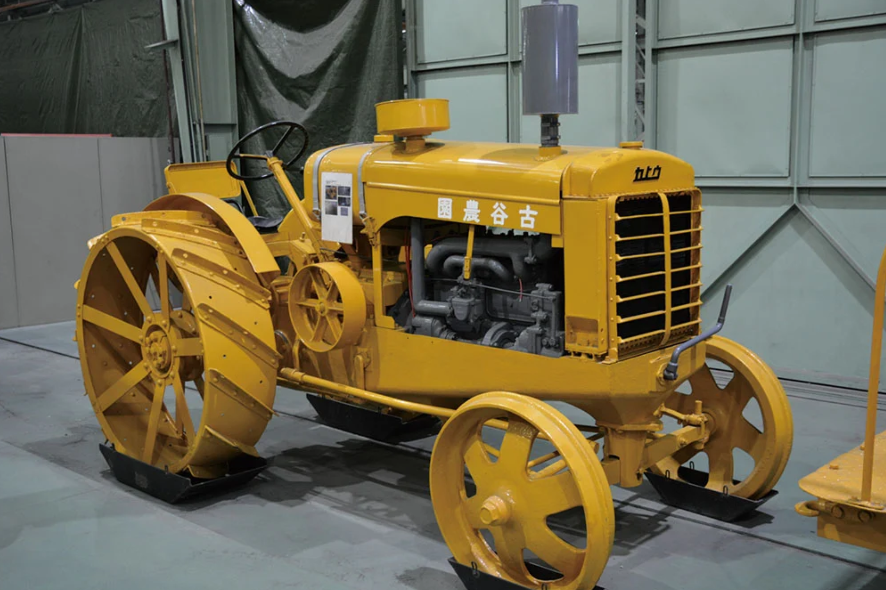

# くれとらっく

丸型ハンドルクローラトラクタ；ロマン





大宮のガラス乾板はなんだろう: model W 

日本にも、何台か現存してる

## 下総御陵牧場
[ブログ](https://ja.localwiki.org/tomi/%E5%AF%8C%E9%87%8C%E7%89%A7%E7%BE%8A%E5%A0%B4%E8%B7%A1)

```
この当時、近隣の農民の多くは人力による農作業を行っていたわけですからその規模の違いが余りにも違うことに驚かされます。
さらに、これらの写真の中で最も興味深いのは、当時、日本では殆ど見ることは不可能であったろう外国製トラクターが写されていたことでした。
これらトラクターの外観を比較してみると、２種類のトラクターが使用されていたことがわかります。
１台はマコーミックディーリング社のＴ２０型、もう１台はクレトラック社のＷ型です。
両社はアメリカのトラクター製造の老舗であり、本国では今でも自走可能な車両が多数残されているようです。
```


## 男爵記念館
[最強でろりさん](http://www.interq.or.jp/sun/mm-kas/ichgon/cletrac.htm)
Wは1919~1932年までの生産
Ｒ（1916～17）、Ｈ（1917～19）、Ｗ（1919～32）

ナロートラックの珍しい型: 初期のもの


## 番外編

加藤製作所のクローラトラクタはcletracを参考にして作ったみたい。
クローラではないけど、ホイールトラクタが五霞にある!?


なんと。すばらしい。
