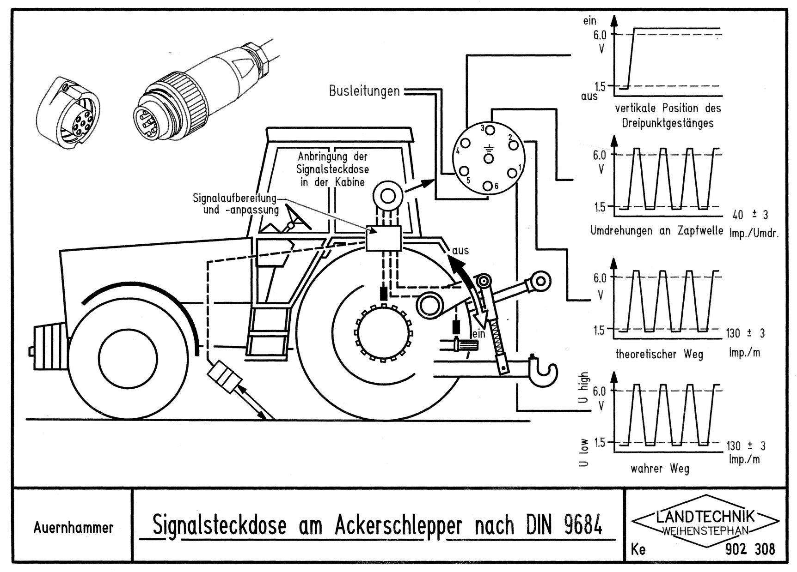

# CFX 750 から速度信号を取り出してAPV controller 5.2に入力することは可能か？
結論: 理論的には可能。しかし、CFX750 -> Ravenコンソールケーブルから分岐させてそのままAPVに入力するのはリスクが伴う。

## 理由
- APV5.2はDIN9684に準拠した速度信号を受け取る: 1.5V- 5V(or 2.5V-3.4V)の電圧差のパルス信号
- CFX750はレーダー生成信号を出力可能: どの電圧で出力するかは、相手のコントローラ次第: ケーブルで工夫
- Raven コンソールは5V or 12Vのパルス速度信号を受け取っている可能性がある。
- つまり、現在のCFX750 - Ravenを繋ぐケーブルは5Vあるいは、12Vのパルス信号を流すように電圧を制御する回路が含まれている可能性がある。
- つまりDIN9684に準拠した信号が流れていない可能性がある。
- 故に、APV5.2を破壊してしまうリスクがある。

## APV controller 5.2のコネクタ
[マニュアル](https://cz.apv.at/fileadmin/user_upload/service/download/Steuermodule/Steuermodul_5.2/BA_5.2_V3.3_en_UK.pdf)を読むと、コントロールボックスの12ピンのコネクタに色々入力するらしい。

色々なアクセサリがあり、7-pin signal cable 


は、DIN9684準拠の信号が流れてるトラクタであれば、ケーブルの7ピン側をキャブ内の7ピンのソケットに差して、APVに入力できるようだ。


APVのコネクタの形状はわからないが、DIN9684に準拠した信号はそのままAPVに入力できるようだ。というかAPV5.2はDIN9684に準拠した信号しか受け付けないのかもしれない。

では、DIN9684に準拠した信号とはどのような信号だろうか。
[ミュンヘン工科大のサイト](https://mediatum.ub.tum.de/?id=708542)
にあるように、

と、トラクタ(shchlepper)の進行距離(weg)を1.5v と6.0v の作動電圧パルスで表現しているらしい。

[ポッティンガーのコントローラのマニュアル](https://www.poettinger.at/download/manuals/56233/0/487.779_en_8_1.pdf)を読むと、1.52V と6.28V の電圧だけではなく、2.54Vと3.42Vの電圧のタイプもあるようだ。

どちらを受け付けているのかわからないけど、この程度の電圧値が入力されれば良いらしい。

APVのマニュアルにもある、GPSA sensor mx

は、gnss で計算した速度入力をDIN9684準拠のパルスにして、入力できるのだろう。

## CFX 750のコネクタ


- CFX750にはdeutsch(ドイチェ)の12ピンポートが2つ、ポートAとポートBがある[マニュアル](https://modernaginc.com/wp-content/uploads/2016/11/cfx-750_cabling-guide.pdf)。

- それぞれのピンアサインは、[ag talk の情報](https://talk.newagtalk.com/forums/thread-view.asp?tid=764687&DisplayType=flat&setCookie=1)を見ると、


という感じらしい。

速度信号を取るには、pin 2 みたい。グランドは、いくつかある8番かな？

deutschコネクタも色々あるけど、[ag talk](https://talk.newagtalk.com/forums/thread-view.asp?tid=307534&DisplayType=flat&setCookie=1)を読むと、
[DTM06-12SA](https://www.digikey.jp/ja/products/detail/te-connectivity-deutsch-ict-connectors/DTM06-12SA/6566630)というコネクタらしい。
コンタクトは、deutschのサイズ20で[良いらしい](https://www.te.com/usa-en/product-DTM06-12SA.datasheet.pdf)。

deutschのコンタクトは全部のコネクタで共通なのかな?


このメスコネクタ、コンタクトを買えば、CFX750の情報は色々取れるというわけだ。

## CFX750が出力する速度信号

以上の2つを合わせると、CFX750がDIN9684準拠のパルス信号を出力できれば、コネクタをつなげるだけで速度が取れるということだ。

[CFX750のマニュアル](https://modernaginc.com/wp-content/uploads/2016/11/cfx-750-user-guide-7a.pdf)にはpp192-193に

```
Digital Output
The CFX-750 display can generate a digital signal on pin 2 of Port A.

Note – Additional equipment may be required to properly use the Digital Output function. 
To use speed pulse output, you need a radar sensor cable kit that includes a pulse amplifier adapter. Contact your local reseller.

``` 

とあり、
|Setting|Explanation|
|----|----|
|Disabled |Tap to turn digital output on or off. When disabled, digital output on pin 2 of Port A is off.|
|Radar| Output simulated radar pulses at a pre-defined speed pulse output rate. This can be useful to <br> Replace the radar/true ground speed sensor for speed on the vehicle <br> Send speed to any other agricultural device requiring speed pulses, such as a yield monitor or variable rate controller. <br> After you select Radar, set the radar frequency rate from the Digital Output screen.|
|Remote Output |Output a signal whenever auto steering is engaged. This can be useful to drive a switch or relay for equipment that should be active when engaged.|

と書いてある。

pulse amplifier adaper が含まれたradar senseor cable kit を買って、Radar モードにすれば良いということである。
速度信号は先程書いた通り、ピン2から出ている。

では、このpulse amplifier adapter cable kit とは何か: 

## CFX750 のケーブルとRaven のコンソール
こういうの.
[Speed Pulse Output Cable, Raven Console](https://store.agexpress.com/fmx-fm1000-and-cfx-750-fm750-speed-pulse-output-cable-raven-console/)

これはravenのコンソールに接続する、ケーブル。
[Ravenのコンソール](https://summersmfg.com/media/1848/raven_scs_440_console_manual.pdf)

raven のコンソールは、5Vか12Vの信号を受け付けている？TTL?? 12V??
どちらだろうか。


cfx750のケーブルからraven コンソールに速度パルスを送るときには、この5Vか12Vの電圧でパルスを送っているということになる。

## CFX750 - Ravenのケーブルから信号・グランドを分岐させて、APVに入力できるか

Ravenのに5Vを入力しているならひょっとしたら行けるかも。12Vなら危ない。

また電圧が範囲内だったとしても、CFX750のパルス設定は変える必要があるかも。
