# 古いスガノのページの画像たち

ワクワクしますなぁ。ありがとうwayback machine.

# 不練レーザー耕法
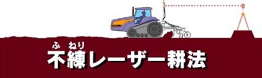

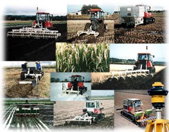

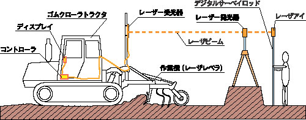

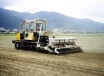
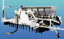
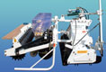

# 反転均平耕法

- プラウ

    - 16" 5連: LCQOY-165CLA 

    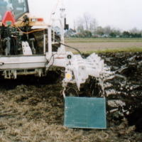

    - 22" 3連: LCQOY-223CLA 

    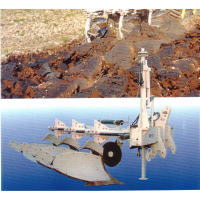

    - 30" 1連: LWDY301G
    
    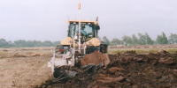

- レーザーレベラー

    - 運土用レーザーレベラー: LL-3000G

    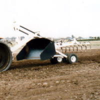

    - 直装式6mレーザーレベラー: LL-6010S

    
    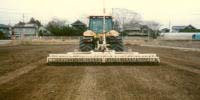

    - 運土

    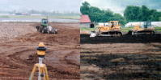

- パンブレーカ

    - パンブレーカ: 10Q-2AR

    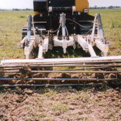

- スタブルカルチ
    
    - スタブルカルチ: SC-11AUW

    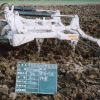
